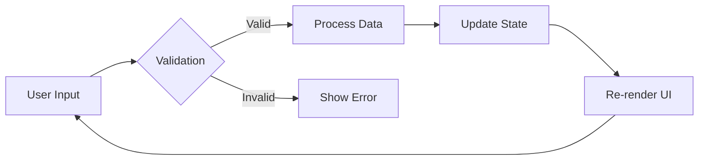

# AI-Assisted Development Workflow Implementation Guide

## Executive Summary

This comprehensive implementation guide provides a production-ready framework for solo developers building React/Next.js applications with Tailwind V4, leveraging advanced AI assistance through Claude Code and Cursor IDE. The guide integrates cutting-edge tools including Vercel AI SDK V5, multiple AI SDKs, automated testing frameworks, and modern component libraries to create an enterprise-scalable development workflow optimized for maximum productivity.

## Core Technology Stack

### Foundation
- **Framework**: Next.js 15 with App Router and React 19
- **Styling**: Tailwind CSS V4 with CSS-first configuration
- **TypeScript**: Strict mode with comprehensive type safety
- **Deployment**: Vercel with AI Gateway integration
- **AI Integration**: Vercel AI SDK V5, OpenAI SDK, Anthropic SDK

### Development Environment
- **Primary IDE**: Cursor with enhanced AI capabilities
- **AI Assistant**: Claude Code with specialized subagents
- **Version Control**: Git with automated workflows
- **Testing**: Playwright MCP, Jest, React Testing Library
- **Code Review**: CodeRabbit automated reviews

## Claude Code Agent Personalities and Deployment

### Available Specialized Subagents

Claude Code employs specialized subagents rather than pre-built personalities. Each subagent operates with independent context windows and domain-specific expertise:

#### Core Development Specialists
```markdown
# UI/UX Engineer
- Frontend specialist for React, Vue, Angular
- Responsive design and accessibility expertise
- Component architecture and state management
- Tailwind CSS optimization

# Backend Architect
- API design and microservices patterns
- Database schema optimization
- Authentication and security implementation
- Performance tuning and caching strategies

# Full-Stack Developer
- End-to-end feature implementation
- Frontend-backend integration
- Real-time features and WebSocket handling
- Deployment and DevOps coordination
```

#### Language and Framework Experts
```markdown
# TypeScript Pro
- Advanced TypeScript patterns and generics
- Type safety enforcement and migrations
- Declaration file creation
- Strict mode optimization

# React Specialist
- React 19 and Server Components
- Hook patterns and custom hooks
- Performance optimization
- State management patterns
```

#### Quality Assurance Specialists
```markdown
# Code Reviewer
- Architecture consistency
- Best practices enforcement
- Security vulnerability detection
- Performance bottleneck identification

# Test Automator
- E2E test creation
- Unit test coverage
- Integration testing patterns
- Test-driven development
```

### Parallel Agent Deployment Strategies

#### When to Use Parallel Deployment

**Optimal for:**
- Independent tasks without dependencies
- Large codebase exploration
- Multi-faceted problems (UI + API + Database)
- Performance optimization across multiple areas

**Hub-and-Spoke Pattern:**
```yaml
Lead Agent (Orchestrator)
├── Subagent 1: Research current implementation
├── Subagent 2: Design new architecture
├── Subagent 3: Implement core features
└── Subagent 4: Create comprehensive tests
```

#### Coordination Strategies

**Multi-Worktree Pattern for Parallel Development:**
```bash
# Create separate worktrees for parallel agent work
git worktree add ../feature-auth auth-feature
git worktree add ../feature-api api-development
git worktree add ../feature-ui ui-components

# Launch Claude in each worktree
claude --project ../feature-auth
claude --project ../feature-api
claude --project ../feature-ui
```

**Performance Considerations:**
- Single agents: ~4× token usage vs chat
- Multi-agent systems: ~15× token usage vs chat
- Optimal: 5-8 agents for most tasks
- Maximum recommended: 10 parallel agents

## Tool Stack Integration

### Vercel AI SDK V5 Configuration

```typescript
// app/api/chat/route.ts
import { openai } from '@ai-sdk/openai';
import { anthropic } from '@ai-sdk/anthropic';
import { convertToModelMessages, streamText, UIMessage } from 'ai';
import { z } from 'zod';
import { tool } from 'ai';

export const runtime = 'edge';

export async function POST(req: Request) {
  const { messages }: { messages: UIMessage[] } = await req.json();
  
  const result = streamText({
    model: process.env.USE_ANTHROPIC === 'true' 
      ? anthropic('claude-3-5-sonnet-20241022')
      : openai('gpt-4o'),
    messages: convertToModelMessages(messages),
    tools: {
      searchDatabase: tool({
        description: 'Search the database',
        inputSchema: z.object({
          query: z.string(),
          limit: z.number().optional().default(10),
        }),
        outputSchema: z.array(z.object({
          id: z.string(),
          name: z.string(),
          data: z.any(),
        })),
        execute: async ({ query, limit }) => {
          // Database search implementation
          return await searchDB(query, limit);
        },
      }),
    },
    experimental_prepareStep: async ({ stepNumber }) => {
      if (stepNumber === 0) {
        return {
          model: openai('gpt-4o-mini'), // Use cheaper model for initial analysis
          toolChoice: { type: 'auto' },
        };
      }
    },
    stopWhen: [
      { type: 'stepCount', value: 5 },
      { type: 'hasToolCall', toolName: 'searchDatabase' },
    ],
  });
  
  return result.toUIMessageStreamResponse();
}
```

### Vercel AI Gateway Setup

```typescript
// lib/ai-gateway.ts
import { createGateway } from '@ai-sdk/gateway';

const gateway = createGateway({
  apiKey: process.env.AI_GATEWAY_API_KEY,
  baseURL: 'https://ai-gateway.vercel.sh/v1/ai',
});

// Multi-provider configuration with fallback
export async function getAIResponse(prompt: string) {
  const providers = [
    'openai/gpt-4o',
    'anthropic/claude-3-5-sonnet',
    'google/gemini-pro',
  ];
  
  try {
    const result = await generateText({
      model: gateway(providers[0]),
      prompt,
      // Gateway handles automatic failover
    });
    return result;
  } catch (error) {
    console.error('AI Gateway error:', error);
    throw error;
  }
}
```

### Development Tool Configurations

#### CodeRabbit Setup
```yaml
# .coderabbit.yaml
language: "en-US"
tone: "professional"
early_access: true

path_instructions:
  - path: "src/app/api/**/*.ts"
    instructions: |
      - Ensure proper error handling with try-catch blocks
      - Validate all inputs using zod schemas
      - Include rate limiting checks
      - Follow RESTful conventions
      
  - path: "src/components/**/*.tsx"
    instructions: |
      - Components must be fully typed with TypeScript
      - Include proper loading and error states
      - Follow atomic design principles
      - Ensure accessibility compliance
      
reviews:
  request_changes_workflow: true
  high_level_summary: true
  poem: false
  review_status: true
  collapse_walkthrough: false
  
tools:
  ruff:
    enabled: false
  
  markdownlint:
    enabled: true
```

#### MCP Server Configuration
```json
// .cursor/mcp.json
{
  "mcpServers": {
    "context7": {
      "command": "npx",
      "args": ["-y", "@upstash/context7-mcp"]
    },
    "sequential-thinking": {
      "command": "npx",
      "args": ["-y", "@modelcontextprotocol/server-sequential-thinking"]
    },
    "playwright": {
      "command": "npx",
      "args": ["@playwright/mcp@latest"]
    },
    "memory": {
      "command": "npx",
      "args": ["-y", "@modelcontextprotocol/server-memory"]
    }
  }
}
```

## Cursor Rules Configuration

### Modern .cursor/rules Structure

```markdown
# .cursor/rules/react-nextjs.mdc
---
description: React/Next.js development patterns with Tailwind V4
globs: ["**/*.{tsx,jsx,ts,js}"]
alwaysApply: false
---

## Framework Requirements
- Use Next.js 15 App Router exclusively
- React Server Components by default
- Client Components only when necessary ('use client' directive)
- TypeScript strict mode enforced

## Component Patterns
- Functional components with TypeScript interfaces
- Named exports preferred over default exports
- Props interfaces defined above components
- Error boundaries for all page components

## Tailwind V4 Configuration
@import "tailwindcss";
@theme {
  --font-sans: "Inter", sans-serif;
  --color-primary: oklch(0.72 0.11 178);
  --spacing-base: 1rem;
}

## File Structure
src/
├── app/              # App Router pages
├── components/       # Reusable components
│   ├── ui/          # Base UI components
│   └── features/    # Feature-specific
├── hooks/           # Custom React hooks
├── lib/            # Utilities and configs
└── types/          # TypeScript definitions

## AI SDK Integration
- Use streamText for streaming responses
- Implement proper error handling
- Cache expensive AI operations
- Track token usage for cost optimization
```

### Cursor to Claude Code Handoff

```markdown
# .cursor/rules/ai-handoff.mdc
---
description: Seamless handoff patterns between Cursor and Claude Code
globs: ["**/*"]
alwaysApply: true
---

## Context Preservation
- Document architectural decisions in docs/architecture/
- Update SESSION_NOTES.md before major changes
- Use @-symbols for surgical context (@file, @folder)
- Keep CLAUDE.md updated with project specifics

## Task Delegation
### Use Cursor for:
- Quick completions (Cmd+K)
- Single-file edits
- Tab completions during active coding
- Visual IDE feedback

### Use Claude Code for:
- Multi-file refactoring
- Complex architectural changes
- Large codebase analysis (18k+ lines)
- Terminal automation tasks

## Memory Checkpoints
Before switching tools:
1. Update CLAUDE.md with current context
2. Commit work-in-progress changes
3. Document open questions in TODO.md
4. Create session notes for continuity
```

## Workflow Templates

### Design Session Template

```markdown
# Design Session: [Feature Name]
Date: [YYYY-MM-DD]
Session ID: design-[feature]-v1

## Objectives
- [ ] Define user requirements
- [ ] Create component architecture
- [ ] Design data flow
- [ ] Plan testing strategy

## Component Hierarchy
```
[Feature]
├── Container (Server Component)
│   ├── DataFetcher
│   └── ErrorBoundary
├── Presentation (Client Component)
│   ├── Header
│   ├── Content
│   └── Actions
└── Utilities
    ├── validators
    └── transformers
```

## Data Flow Diagram


## Animation Requirements
- Entry: fade-in with 200ms duration
- Interaction: scale on hover (1.02)
- Exit: fade-out with 150ms duration
- Loading: skeleton pulse animation

## Theme Tokens
```css
@theme {
  --color-feature-primary: oklch(0.65 0.15 250);
  --color-feature-secondary: oklch(0.75 0.10 250);
  --spacing-feature: 1.25rem;
}
```
```

### ASCII Architecture Diagrams

```markdown
# System Architecture

## High-Level Overview
┌─────────────────────────────────────────────────────┐
│                   Client Browser                      │
│  ┌─────────────────────────────────────────────┐    │
│  │          Next.js App (React 19)              │    │
│  │  ┌──────────────┐  ┌──────────────┐        │    │
│  │  │    Pages     │  │  Components  │        │    │
│  │  └──────────────┘  └──────────────┘        │    │
│  │  ┌──────────────────────────────────┐      │    │
│  │  │     Vercel AI SDK V5             │      │    │
│  │  └──────────────────────────────────┘      │    │
│  └─────────────────────────────────────────────┘    │
└─────────────────────────────────────────────────────┘
                           │
                           ▼
┌─────────────────────────────────────────────────────┐
│                  Edge Runtime                        │
│  ┌─────────────────────────────────────────────┐    │
│  │            API Routes                        │    │
│  │  ┌──────────┐  ┌──────────┐  ┌──────────┐ │    │
│  │  │   Auth   │  │   Chat   │  │   Data   │ │    │
│  │  └──────────┘  └──────────┘  └──────────┘ │    │
│  └─────────────────────────────────────────────┘    │
└─────────────────────────────────────────────────────┘
                           │
                           ▼
┌─────────────────────────────────────────────────────┐
│                 External Services                    │
│  ┌──────────┐  ┌──────────┐  ┌──────────┐         │
│  │ OpenAI   │  │ Claude   │  │ Database │         │
│  └──────────┘  └──────────┘  └──────────┘         │
└─────────────────────────────────────────────────────┘

## Component Tree Structure
App/
├── layout.tsx (Root Layout)
│   ├── Providers/
│   │   ├── ThemeProvider
│   │   ├── AuthProvider
│   │   └── AIProvider
│   └── children
│       ├── page.tsx (Home)
│       ├── dashboard/
│       │   └── page.tsx
│       └── api/
│           ├── chat/
│           └── auth/
```

### Sprint Planning Template

```markdown
# Sprint: [Sprint Name]
Duration: [Start Date] - [End Date]
Sprint Goal: [Clear, measurable objective]

## Priorities (MoSCoW)

### Must Have (P0)
- [ ] Core authentication flow
- [ ] Database schema setup
- [ ] Basic CRUD operations

### Should Have (P1) 
- [ ] Email notifications
- [ ] Advanced search filters
- [ ] Performance optimizations

### Could Have (P2)
- [ ] Analytics dashboard
- [ ] Export functionality
- [ ] Advanced animations

### Won't Have (This Sprint)
- Social media integration
- Mobile app

## Daily Structure
```
09:00-09:30  Review plan, check context
09:30-12:30  Deep work block 1 (hardest task)
12:30-13:30  Break
13:30-16:30  Deep work block 2 (implementation)
16:30-17:00  Testing and documentation
17:00-17:30  Update progress, plan next day
```

## Success Metrics
- [ ] All P0 items complete
- [ ] 80% test coverage achieved
- [ ] Documentation updated
- [ ] Deployed to staging
```

## Memory Management Configuration

### Claude Memory Files

```markdown
# CLAUDE.md - Project Root Memory

## Project: [Project Name]
Type: React/Next.js Web Application
Stage: Development
Last Updated: [Date]

## Technology Stack
- Next.js 15 with App Router
- React 19 with Server Components
- TypeScript (strict mode)
- Tailwind CSS V4
- Vercel AI SDK V5
- PostgreSQL with Drizzle ORM

## Code Conventions
### TypeScript
- Interfaces over types
- Explicit return types for functions
- No any types allowed
- Strict null checks enabled

### React Patterns  
- Functional components only
- Custom hooks in hooks/ directory
- Error boundaries for all routes
- Loading states for async operations

### File Organization
- Feature-based structure
- Colocation of related files
- Index files for clean exports
- Test files adjacent to source

## Architecture Decisions
- Server Components by default
- Client Components only for interactivity
- API routes for external integrations
- Edge runtime for AI endpoints
- Incremental Static Regeneration for content

## Development Commands
npm run dev          # Start development server
npm run build       # Production build
npm run test        # Run test suite
npm run lint        # ESLint checking
npm run type-check  # TypeScript validation

## Current Focus
Working on user authentication system with JWT tokens and refresh rotation.

## Environment Variables
NEXT_PUBLIC_APP_URL=http://localhost:3000
DATABASE_URL=[PostgreSQL connection string]
OPENAI_API_KEY=[OpenAI API key]
ANTHROPIC_API_KEY=[Anthropic API key]
```

### Session Management

```json
// .claude/settings.json
{
  "permissions": {
    "allow": [
      "Read", "Edit", "Write", "Grep",
      "Bash(npm run:*)",
      "Bash(git:*)",
      "Edit(**/*.{ts,tsx,js,jsx})"
    ],
    "deny": [
      "Read(.env*)",
      "Bash(rm -rf:*)",
      "Bash(git push:*)"
    ]
  },
  "env": {
    "NODE_ENV": "development",
    "NEXT_TELEMETRY_DISABLED": "1"
  },
  "hooks": {
    "PostToolUse": [{
      "matcher": "Edit|Write",
      "hooks": [{
        "type": "command",
        "command": "npm run lint:fix"
      }]
    }]
  },
  "mcpServers": {
    "memory": {
      "command": "npx",
      "args": ["-y", "@modelcontextprotocol/server-memory"]
    }
  }
}
```

### Memory Optimization Patterns

```markdown
# Memory Management Strategy

## Token Optimization
- Keep memory files under 2,000 tokens each
- Use @file references instead of copying
- Regular cleanup with /clear command
- Archive old sessions to docs/archive/

## Session Checkpoints
Before major changes:
1. Update CLAUDE.md with architectural decisions
2. Document in SESSION_NOTES.md
3. Create backup: git stash save "checkpoint-[feature]"
4. Clear context: /clear

## Hierarchical Loading
Essential (Always Load):
- Core project info
- Current task context
- Critical conventions

On-Demand (Reference Only):
- Detailed docs → @docs/
- Examples → @examples/
- Archives → @archive/
```

## Design Libraries Integration

### Component Library Stack

```typescript
// components.config.ts
export const componentLibraries = {
  // Core UI Components
  base: 'shadcn/ui',      // V4 Tailwind support, React 19 ready
  dashboard: 'tremor',    // Now free under Vercel
  animations: 'framer-motion', // Now called "Motion"
  
  // Supporting Libraries
  primitives: 'radix-ui', // Accessible unstyled components
  icons: 'lucide-react',  // Comprehensive icon set
  forms: 'react-hook-form', // Form management
  
  // Development Tools
  testing: '@testing-library/react',
  storybook: '@storybook/react',
  linting: 'eslint-plugin-jsx-a11y',
};
```

### Tailwind V4 Theme Configuration

```css
/* app/globals.css */
@import "tailwindcss";

@theme {
  /* Color System - OKLCH for consistency */
  --color-primary: oklch(0.72 0.11 178);
  --color-secondary: oklch(0.65 0.15 250);
  --color-success: oklch(0.75 0.18 145);
  --color-warning: oklch(0.80 0.20 85);
  --color-error: oklch(0.65 0.25 25);
  
  /* Typography */
  --font-sans: "Inter", -apple-system, sans-serif;
  --font-mono: "JetBrains Mono", monospace;
  --font-display: "Cal Sans", var(--font-sans);
  
  /* Spacing Scale */
  --spacing-base: 1rem;
  --spacing-scale: 1.25;
  
  /* Animation */
  --ease-in: cubic-bezier(0.4, 0, 1, 1);
  --ease-out: cubic-bezier(0, 0, 0.2, 1);
  --ease-fluid: cubic-bezier(0.3, 0, 0, 1);
  
  /* Breakpoints */
  --breakpoint-3xl: 1920px;
  --breakpoint-4xl: 2560px;
}

/* Container Queries */
@container (min-width: 768px) {
  .responsive-grid {
    grid-template-columns: repeat(3, 1fr);
  }
}

/* View Transitions */
@view-transition {
  navigation: auto;
}
```

## Solo Developer Productivity Framework

### Daily Workflow Structure

```markdown
# Daily Development Routine

## Morning Setup (9:00-9:30)
1. Review CLAUDE.md and SESSION_NOTES.md
2. Check GitHub issues and PRs
3. Update task priorities
4. Launch development environment

## Deep Work Block 1 (9:30-12:30)
- Focus: Most challenging task
- Tools: Claude Code for architecture
- Method: TDD approach
- No interruptions (airplane mode)

## Midday Break (12:30-13:30)
- Physical activity
- Review morning progress
- Plan afternoon tasks

## Deep Work Block 2 (13:30-16:30)
- Focus: Implementation and testing
- Tools: Cursor for rapid development
- Method: Feature completion
- Batch similar tasks

## Testing & Documentation (16:30-17:00)
- Run test suite
- Update documentation
- Code review with AI

## Wrap-up (17:00-17:30)
- Commit and push changes
- Update progress tracking
- Plan tomorrow's priorities
- Update memory files
```

### Task Prioritization Matrix

```markdown
# Eisenhower Matrix for Development

## Important & Urgent (Do First)
- Production bugs
- Security vulnerabilities
- Deadline features
- Customer-blocking issues

## Important & Not Urgent (Schedule)
- Architecture improvements
- Performance optimizations
- Technical debt reduction
- Learning new technologies

## Not Important & Urgent (Delegate/Automate)
- Routine deployments → CI/CD
- Code formatting → Prettier
- Dependency updates → Renovate
- Basic testing → AI assistants

## Not Important & Not Urgent (Eliminate)
- Premature optimizations
- Feature creep
- Unnecessary refactoring
- Social media during work
```

## Performance Optimization Guidelines

### Bundle Size Management

```javascript
// next.config.js
module.exports = {
  experimental: {
    optimizePackageImports: [
      'lucide-react',
      '@heroicons/react',
      'date-fns',
      'lodash-es',
    ],
  },
  modularizeImports: {
    '@heroicons/react/24/outline': {
      transform: '@heroicons/react/24/outline/{{member}}',
    },
    'lodash-es': {
      transform: 'lodash-es/{{member}}',
    },
  },
};
```

### AI Cost Optimization

```typescript
// lib/ai-cost-optimizer.ts
export const modelSelection = {
  simple: 'gpt-4o-mini',          // $0.15/1M tokens
  standard: 'gpt-4o',             // $2.50/1M tokens  
  complex: 'claude-3-5-sonnet',   // $3.00/1M tokens
  reasoning: 'o1-mini',           // $3.00/1M tokens
};

export function selectModel(complexity: 'simple' | 'standard' | 'complex') {
  const costThreshold = process.env.COST_THRESHOLD || 100;
  const currentSpend = getCurrentMonthSpend();
  
  if (currentSpend > costThreshold) {
    return modelSelection.simple;
  }
  
  return modelSelection[complexity];
}
```

## Deployment and CI/CD Configuration

### Vercel Deployment

```json
// vercel.json
{
  "buildCommand": "npm run build",
  "devCommand": "npm run dev",
  "installCommand": "npm install",
  "framework": "nextjs",
  "regions": ["iad1"],
  "functions": {
    "app/api/chat/route.ts": {
      "maxDuration": 60,
      "runtime": "edge"
    }
  },
  "env": {
    "NEXT_PUBLIC_APP_URL": "$VERCEL_URL"
  }
}
```

### GitHub Actions Workflow

```yaml
# .github/workflows/ci.yml
name: CI/CD Pipeline

on:
  push:
    branches: [main, develop]
  pull_request:
    branches: [main]

jobs:
  test:
    runs-on: ubuntu-latest
    steps:
      - uses: actions/checkout@v4
      - uses: actions/setup-node@v4
        with:
          node-version: '20'
          cache: 'npm'
      
      - run: npm ci
      - run: npm run lint
      - run: npm run type-check
      - run: npm run test
      - run: npm run build
      
  deploy:
    needs: test
    if: github.ref == 'refs/heads/main'
    runs-on: ubuntu-latest
    steps:
      - uses: actions/checkout@v4
      - uses: amondnet/vercel-action@v25
        with:
          vercel-token: ${{ secrets.VERCEL_TOKEN }}
          vercel-org-id: ${{ secrets.VERCEL_ORG_ID }}
          vercel-project-id: ${{ secrets.VERCEL_PROJECT_ID }}
          vercel-args: '--prod'
```

## Key Implementation Checklist

### Initial Setup
- [ ] Initialize Next.js 15 with TypeScript
- [ ] Configure Tailwind CSS V4
- [ ] Set up Vercel AI SDK V5
- [ ] Install and configure Cursor IDE
- [ ] Set up Claude Code with subagents
- [ ] Configure CodeRabbit for reviews
- [ ] Initialize MCP servers
- [ ] Create initial CLAUDE.md files

### Development Environment
- [ ] Configure .cursor/rules/ directory
- [ ] Set up component library (shadcn/ui)
- [ ] Configure testing framework
- [ ] Set up CI/CD pipeline
- [ ] Configure environment variables
- [ ] Set up error tracking
- [ ] Initialize documentation

### Workflow Optimization
- [ ] Create workflow templates
- [ ] Set up ASCII diagram tools
- [ ] Configure memory management
- [ ] Establish coding conventions
- [ ] Create sprint templates
- [ ] Set up productivity tracking
- [ ] Configure AI cost monitoring

This comprehensive implementation guide provides everything needed to establish a highly productive, AI-assisted development workflow for building scalable React/Next.js applications. The combination of advanced AI tools, modern frameworks, and optimized workflows enables solo developers to achieve enterprise-level productivity while maintaining code quality and scalability.