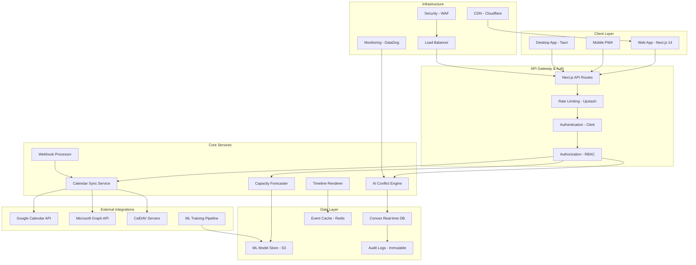

# Technical Architecture Specification
## Command Center Calendar AI-Powered Scheduling Efficiency Platform

---

**Document Version**: 1.0  
**Date**: January 2025  
**Status**: Implementation Ready  
**Alignment**: Ultimate PRD v3.0  

---

## 🏗️ System Architecture Overview

### Core Architecture Principles

```typescript
interface ArchitecturalPrinciples {
  foundation: {
    immutableTimeline: "12-month horizontal layout is LOCKED and cannot be modified";
    buildOnExisting: "Enhance current 112 FPS, 4-provider integration, enterprise security";
    performanceFirst: "Maintain >60 FPS with 10,000+ events";
    securityByDesign: "Zero-trust architecture with AES-256-GCM encryption";
  };
  
  scalability: {
    horizontalScaling: "Microservices architecture for independent scaling";
    eventDriven: "Async processing with event sourcing patterns";
    caching: "Multi-layer caching for performance optimization";
    monitoring: "Comprehensive observability and alerting";
  };
  
  reliability: {
    availability: "99.95% uptime target with graceful degradation";
    consistency: "Strong consistency for conflicts, eventual for analytics";
    recovery: "Automated backup and disaster recovery";
    testing: "Comprehensive testing including chaos engineering";
  };
}
```

### High-Level System Architecture



## 🧠 AI Conflict Prevention System

### Core AI Engine Architecture

```typescript
// Advanced Conflict Detection Engine
class AIConflictEngine {
  private mlModel: TensorFlowModel;
  private graphProcessor: ConflictGraphProcessor;
  private patternMatcher: UserPatternMatcher;
  private ruleEngine: BusinessRuleEngine;
  
  constructor() {
    this.mlModel = new TensorFlowModel({
      modelPath: '/models/conflict-detection-v1.0.pb',
      inputShape: [null, 50], // Variable batch size, 50 features
      outputShape: [null, 5]  // 5 conflict types
    });
    
    this.graphProcessor = new ConflictGraphProcessor({
      algorithm: 'constraint-satisfaction',
      optimization: 'simulated-annealing'
    });
  }
  
  // Main conflict detection pipeline (<200ms target)
  async detectConflicts(events: Event[], context: DetectionContext): Promise<ConflictResult> {
    const startTime = performance.now();
    
    // Step 1: Fast graph-based detection (50ms)
    const graphConflicts = await this.graphProcessor.detectConflicts(events);
    
    // Step 2: ML-based pattern analysis (100ms)
    const mlConflicts = await this.mlModel.predict(
      this.extractFeatures(events, context)
    );
    
    // Step 3: Business rule validation (30ms)
    const ruleConflicts = await this.ruleEngine.validate(events, context);
    
    // Step 4: Conflict consolidation and prioritization (20ms)
    const consolidatedConflicts = this.consolidateConflicts([
      ...graphConflicts,
      ...mlConflicts,
      ...ruleConflicts
    ]);
    
    const processingTime = performance.now() - startTime;
    
    // Ensure we meet <200ms SLA
    if (processingTime > 200) {
      await this.logPerformanceAlert({
        processingTime,
        eventCount: events.length,
        contextSize: Object.keys(context).length
      });
    }
    
    return {
      conflicts: consolidatedConflicts,
      confidence: this.calculateOverallConfidence(consolidatedConflicts),
      processingTime,
      metadata: {
        graphConflicts: graphConflicts.length,
        mlConflicts: mlConflicts.length,
        ruleConflicts: ruleConflicts.length
      }
    };
  }
  
  // Generate repair suggestions with confidence scores
  async generateRepairSuggestions(conflict: Conflict): Promise<RepairSuggestion[]> {
    const suggestions: RepairSuggestion[] = [];
    
    // ML-powered optimal rescheduling
    const mlSuggestions = await this.mlModel.predictRepairs({
      conflict,
      userPatterns: await this.patternMatcher.getUserPatterns(conflict.userId),
      organizationRules: await this.ruleEngine.getOrganizationRules(conflict.orgId),
      historicalData: await this.getHistoricalRepairs(conflict.userId)
    });
    
    // Graph-based optimal scheduling
    const graphSuggestions = await this.graphProcessor.generateOptimalSchedule(
      conflict,
      await this.getSchedulingConstraints(conflict.userId)
    );
    
    // Combine and rank suggestions
    const combinedSuggestions = [...mlSuggestions, ...graphSuggestions];
    
    return this.rankSuggestions(combinedSuggestions).slice(0, 5); // Top 5 suggestions
  }
  
  // Real-time conflict prevention for new events
  async preventConflict(newEvent: Event, existingEvents: Event[]): Promise<PreventionResult> {
    const potentialConflicts = await this.detectConflicts([...existingEvents, newEvent], {
      mode: 'prevention',
      realTime: true
    });
    
    if (potentialConflicts.conflicts.length === 0) {
      return { allowed: true, suggestions: [] };
    }
    
    const preventionSuggestions = await this.generatePreventionSuggestions(
      newEvent,
      potentialConflicts.conflicts
    );
    
    return {
      allowed: false,
      conflicts: potentialConflicts.conflicts,
      suggestions: preventionSuggestions,
      alternativeTimes: await this.suggestAlternativeTimes(newEvent, existingEvents)
    };
  }
}

// Constraint Satisfaction Problem solver for complex scheduling
class ConflictGraphProcessor {
  private graph: ConflictGraph;
  private optimizer: SchedulingOptimizer;
  
  // Build conflict graph from events
  buildConflictGraph(events: Event[]): ConflictGraph {
    const graph = new ConflictGraph();
    
    // Add nodes for each event
    events.forEach(event => {
      graph.addNode(event.id, {
        event,
        constraints: this.extractConstraints(event),
        flexibility: this.calculateFlexibility(event)
      });
    });
    
    // Add edges for conflicts
    events.forEach(event1 => {
      events.forEach(event2 => {
        if (event1.id !== event2.id) {
          const conflictType = this.detectConflictType(event1, event2);
          if (conflictType) {
            graph.addEdge(event1.id, event2.id, {
              type: conflictType,
              severity: this.calculateSeverity(event1, event2, conflictType),
              resolutionOptions: this.getResolutionOptions(event1, event2, conflictType)
            });
          }
        }
      });
    });
    
    return graph;
  }
  
  // Solve using advanced constraint satisfaction algorithms
  async solveOptimalSchedule(
    events: Event[],
    constraints: SchedulingConstraints
  ): Promise<OptimalScheduleResult> {
    const graph = this.buildConflictGraph(events);
    
    // Use simulated annealing for optimization
    const solution = await this.optimizer.simulatedAnnealing({
      graph,
      constraints,
      temperature: 1000,
      coolingRate: 0.95,
      minTemperature: 1,
      maxIterations: 10000
    });
    
    return {
      schedule: solution.schedule,
      conflicts: solution.remainingConflicts,
      optimizationScore: solution.score,
      convergenceMetrics: solution.metrics,
      alternatives: await this.generateAlternatives(solution, 3)
    };
  }
  
  // Detect different types of conflicts
  private detectConflictType(event1: Event, event2: Event): ConflictType | null {
    // Time overlap conflicts
    if (this.hasTimeOverlap(event1, event2)) {
      return ConflictType.TIME_OVERLAP;
    }
    
    // Travel time conflicts
    if (this.hasTravelConflict(event1, event2)) {
      return ConflictType.TRAVEL_TIME;
    }
    
    // Resource conflicts (same room, equipment)
    if (this.hasResourceConflict(event1, event2)) {
      return ConflictType.RESOURCE;
    }
    
    // Attendee conflicts (double-booking people)
    if (this.hasAttendeeConflict(event1, event2)) {
      return ConflictType.ATTENDEE;
    }
    
    // Capacity conflicts (overloaded schedule)
    if (this.hasCapacityConflict(event1, event2)) {
      return ConflictType.CAPACITY;
    }
    
    return null;
  }
}
```

### ML Model Architecture

```typescript
// TensorFlow model for conflict prediction and optimization
interface MLModelArchitecture {
  // Input features (50 dimensions)
  features: {
    temporal: [
      'start_hour', 'end_hour', 'duration_minutes', 'day_of_week',
      'week_of_year', 'is_weekend', 'is_holiday'
    ];
    spatial: [
      'has_location', 'travel_time_minutes', 'location_type',
      'is_remote', 'timezone_offset'
    ];
    attendees: [
      'attendee_count', 'external_attendees', 'vip_attendees',
      'recurring_attendees', 'new_attendees'
    ];
    context: [
      'meeting_type', 'priority_level', 'is_recurring',
      'buffer_time_before', 'buffer_time_after'
    ];
    historical: [
      'user_pattern_score', 'historical_conflicts', 'reschedule_frequency',
      'cancellation_rate', 'attendance_rate'
    ];
    organizational: [
      'department_load', 'team_capacity', 'business_hours',
      'company_policies', 'seasonal_patterns'
    ];
  };
  
  // Model architecture
  architecture: {
    inputLayer: "Dense(50, activation='relu')";
    hiddenLayers: [
      "Dense(128, activation='relu', dropout=0.3)",
      "Dense(64, activation='relu', dropout=0.2)",
      "Dense(32, activation='relu', dropout=0.1)"
    ];
    outputLayer: "Dense(5, activation='softmax')"; // 5 conflict types
  };
  
  // Output classes
  outputs: {
    conflictProbabilities: [
      'no_conflict',      // 0.0-1.0 probability
      'time_overlap',     // 0.0-1.0 probability
      'travel_conflict',  // 0.0-1.0 probability
      'capacity_overload', // 0.0-1.0 probability
      'resource_conflict' // 0.0-1.0 probability
    ];
  };
  
  // Training configuration
  training: {
    optimizer: 'Adam';
    learningRate: 0.001;
    batchSize: 32;
    epochs: 100;
    validationSplit: 0.2;
    earlyStoppingPatience: 10;
  };
}

// ML Training Pipeline
class MLTrainingPipeline {
  private dataProcessor: DataProcessor;
  private modelTrainer: ModelTrainer;
  private evaluator: ModelEvaluator;
  
  // Automated model training and deployment
  async trainAndDeploy(): Promise<ModelDeploymentResult> {
    // Step 1: Data collection and preprocessing
    const trainingData = await this.dataProcessor.collectTrainingData({
      timeRange: { start: '2024-01-01', end: '2025-01-01' },
      minSamplesPerUser: 100,
      includeConflictResolutions: true,
      anonymize: true
    });
    
    // Step 2: Feature engineering
    const features = await this.dataProcessor.extractFeatures(trainingData);
    
    // Step 3: Model training
    const model = await this.modelTrainer.train({
      features,
      architecture: MLModelArchitecture,
      hyperparameters: await this.optimizeHyperparameters(features)
    });
    
    // Step 4: Model evaluation
    const evaluation = await this.evaluator.evaluate(model, {
      testSet: await this.dataProcessor.getTestSet(),
      metrics: ['accuracy', 'precision', 'recall', 'f1_score', 'auc']
    });
    
    // Step 5: A/B testing preparation
    if (evaluation.accuracy > 0.95) {
      return await this.deployModel(model, {
        rolloutStrategy: 'canary',
        rolloutPercentage: 5,
        monitoringMetrics: ['accuracy', 'latency', 'user_satisfaction']
      });
    }
    
    throw new Error(`Model accuracy ${evaluation.accuracy} below threshold 0.95`);
  }
}
```

## 📊 Capacity Forecasting System

### Capacity Calculation Engine

```typescript
// Advanced Capacity Forecasting with ML
class CapacityForecastingSystem {
  private mlPredictor: MLCapacityPredictor;
  private timeSeriesAnalyzer: TimeSeriesAnalyzer;
  private visualizer: CapacityVisualizer;
  private alertSystem: CapacityAlertSystem;
  
  // Core workload density calculation
  calculateWorkloadDensity(
    events: Event[],
    timeRange: TimeRange,
    workingHours: WorkingHoursConfig
  ): DensityMetrics {
    const analysis = this.analyzeTimeRange(events, timeRange, workingHours);
    
    return {
      // Core density metric (0-1 scale)
      density: Math.min(analysis.totalMeetingHours / analysis.availableHours, 1),
      
      // Detailed breakdown
      totalMeetingHours: analysis.totalMeetingHours,
      availableHours: analysis.availableHours,
      utilizationRate: analysis.totalMeetingHours / analysis.availableHours,
      
      // Advanced metrics
      fragmentationIndex: this.calculateFragmentation(events, timeRange),
      focusTimeAvailable: this.calculateFocusTime(events, timeRange, workingHours),
      overloadRisk: this.assessOverloadRisk(analysis),
      
      // Temporal distribution
      hourlyDistribution: this.getHourlyDistribution(events, timeRange),
      dailyDistribution: this.getDailyDistribution(events, timeRange),
      weeklyPattern: this.getWeeklyPattern(events, timeRange)
    };
  }
  
  // Generate capacity signals for timeline visualization
  async generateCapacitySignals(
    userId: string,
    timeRange: TimeRange
  ): Promise<CapacitySignal[]> {
    const events = await this.getEventsForUser(userId, timeRange);
    const workingHours = await this.getUserWorkingHours(userId);
    const userPatterns = await this.getUserPatterns(userId);
    
    // Monthly capacity analysis
    const monthlySignals = await this.generateMonthlySignals(
      events,
      timeRange,
      workingHours,
      userPatterns
    );
    
    // Weekly capacity analysis
    const weeklySignals = await this.generateWeeklySignals(
      events,
      timeRange,
      workingHours,
      userPatterns
    );
    
    // Daily capacity analysis
    const dailySignals = await this.generateDailySignals(
      events,
      timeRange,
      workingHours,
      userPatterns
    );
    
    return {
      monthly: monthlySignals,
      weekly: weeklySignals,
      daily: dailySignals,
      aggregated: this.aggregateSignals(monthlySignals, weeklySignals, dailySignals)
    };
  }
  
  // ML-based capacity prediction
  async predictCapacity(
    userId: string,
    forecastHorizon: number, // days
    confidenceLevel: number = 0.85
  ): Promise<CapacityForecast> {
    const historicalData = await this.getHistoricalData(userId, {
      lookbackDays: Math.max(forecastHorizon * 4, 90) // At least 90 days
    });
    
    const features = this.extractPredictionFeatures(historicalData);
    const externalFactors = await this.getExternalFactors(userId, forecastHorizon);
    
    // Time series prediction using LSTM
    const prediction = await this.mlPredictor.predict({
      features,
      horizon: forecastHorizon,
      externalFactors,
      confidenceLevel
    });
    
    return {
      forecast: prediction.values,
      confidence: prediction.confidence,
      confidenceInterval: prediction.interval,
      trends: this.analyzeTrends(prediction.values),
      seasonality: this.detectSeasonality(historicalData),
      anomalies: this.detectAnomalies(prediction.values),
      recommendations: await this.generateCapacityRecommendations(prediction)
    };
  }
  
  // Real-time capacity monitoring and alerting
  async monitorCapacity(userId: string): Promise<CapacityMonitoringResult> {
    const currentCapacity = await this.getCurrentCapacity(userId);
    const thresholds = await this.getUserCapacityThresholds(userId);
    
    const alerts: CapacityAlert[] = [];
    
    // Check for overload conditions
    if (currentCapacity.density > thresholds.overloadThreshold) {
      alerts.push({
        type: 'overload',
        severity: 'high',
        message: `Workload density ${(currentCapacity.density * 100).toFixed(1)}% exceeds threshold ${(thresholds.overloadThreshold * 100).toFixed(1)}%`,
        recommendations: await this.generateOverloadRecommendations(currentCapacity)
      });
    }
    
    // Check for capacity warnings
    if (currentCapacity.density > thresholds.warningThreshold) {
      alerts.push({
        type: 'warning',
        severity: 'medium',
        message: `Approaching capacity limit: ${(currentCapacity.density * 100).toFixed(1)}%`,
        recommendations: await this.generateWarningRecommendations(currentCapacity)
      });
    }
    
    // Check for fragmentation issues
    if (currentCapacity.fragmentationIndex > thresholds.fragmentationThreshold) {
      alerts.push({
        type: 'fragmentation',
        severity: 'medium',
        message: `Schedule fragmentation detected: ${currentCapacity.fragmentationIndex.toFixed(2)}`,
        recommendations: await this.generateFragmentationRecommendations(currentCapacity)
      });
    }
    
    return {
      currentCapacity,
      alerts,
      trends: await this.getCapacityTrends(userId, 30), // 30-day trends
      nextReview: this.calculateNextReviewTime(currentCapacity)
    };
  }
}

// Capacity visualization integrated with horizontal timeline
class CapacityTimelineIntegration {
  // Render capacity ribbons on the 12-month timeline
  renderTimelineWithCapacity(
    timelineData: TimelineData,
    capacitySignals: CapacitySignal[]
  ): React.Component {
    return (
      <div className="horizontal-timeline-with-capacity">
        {/* Preserve the locked 12-month horizontal structure */}
        <LinearCalendarHorizontal
          year={timelineData.year}
          events={timelineData.events}
          className="h-full w-full"
          
          // Add capacity overlays without modifying core structure
          overlays={[
            // Capacity density ribbons
            <CapacityRibbonOverlay 
              key="capacity-ribbons"
              signals={capacitySignals}
              thresholds={{
                warning: 0.8,   // 80% capacity
                critical: 0.95, // 95% capacity
                optimal: 0.65   // 65% capacity
              }}
              colorScale={{
                low: 'hsl(var(--success))',
                medium: 'hsl(var(--warning))',
                high: 'hsl(var(--destructive))'
              }}
            />,
            
            // Overload alerts
            <OverloadAlertOverlay
              key="overload-alerts"
              alerts={capacitySignals
                .filter(s => s.overloadRisk === 'high')
                .map(s => ({
                  month: s.month,
                  year: s.year,
                  severity: s.overloadRisk,
                  message: `${(s.workloadDensity * 100).toFixed(0)}% capacity`,
                  recommendations: s.recommendations
                }))
              }
            />,
            
            // Focus time indicators
            <FocusTimeOverlay
              key="focus-time"
              focusBlocks={this.extractFocusTimeBlocks(capacitySignals)}
              minBlockSize={60} // 60-minute minimum blocks
            />
          ]}
          
          // Enhanced event rendering with capacity context
          eventRenderer={(event, month) => (
            <EnhancedEventRenderer
              event={event}
              month={month}
              capacityContext={this.getCapacityContext(event, capacitySignals)}
              conflictStatus={this.getConflictStatus(event)}
            />
          )}
        />
        
        {/* Capacity controls and legend */}
        <CapacityControlPanel
          signals={capacitySignals}
          onThresholdChange={this.handleThresholdChange}
          onViewModeChange={this.handleViewModeChange}
        />
      </div>
    );
  }
  
  // Generate capacity ribbon visualization data
  private generateCapacityRibbons(signals: CapacitySignal[]): CapacityRibbon[] {
    return signals.map(signal => ({
      month: signal.month,
      year: signal.year,
      density: signal.workloadDensity,
      color: this.getCapacityColor(signal.workloadDensity),
      height: this.getCapacityHeight(signal.workloadDensity),
      pattern: this.getCapacityPattern(signal),
      interactive: {
        tooltip: this.generateCapacityTooltip(signal),
        onClick: () => this.showCapacityDetails(signal),
        onHover: () => this.highlightRelatedEvents(signal)
      }
    }));
  }
}
```

## 🔐 Enterprise Security Architecture

### Zero-Trust Security Implementation

```typescript
// Enhanced security building on existing AES-256-GCM foundation
class EnterpriseSecuritySystem {
  private encryptionEngine: AESGCMEncryption; // Existing implementation
  private auditLogger: AuditLogger; // Existing implementation
  private accessController: ZeroTrustAccessController; // New
  private threatDetector: ThreatDetectionEngine; // New
  
  // Zero-trust architecture implementation
  async implementZeroTrust(): Promise<ZeroTrustConfiguration> {
    return {
      // Never trust, always verify
      verification: {
        userVerification: await this.setupContinuousUserVerification(),
        deviceVerification: await this.setupDeviceVerification(),
        networkVerification: await this.setupNetworkVerification(),
        applicationVerification: await this.setupApplicationVerification()
      },
      
      // Least privilege access
      accessControl: {
        roleBasedAccess: await this.implementRBAC(),
        attributeBasedAccess: await this.implementABAC(),
        justInTimeAccess: await this.implementJITAccess(),
        privilegedAccessManagement: await this.implementPAM()
      },
      
      // Micro-segmentation
      segmentation: {
        networkSegmentation: await this.implementNetworkSegmentation(),
        applicationSegmentation: await this.implementApplicationSegmentation(),
        dataSegmentation: await this.implementDataSegmentation()
      },
      
      // Continuous monitoring
      monitoring: {
        userBehaviorAnalytics: await this.setupUBA(),
        networkMonitoring: await this.setupNetworkMonitoring(),
        applicationMonitoring: await this.setupApplicationMonitoring(),
        threatIntelligence: await this.setupThreatIntelligence()
      }
    };
  }
  
  // Advanced webhook security with signature verification
  async verifyWebhookSignature(
    payload: string,
    signature: string,
    provider: CalendarProvider,
    timestamp: number
  ): Promise<WebhookVerificationResult> {
    // Timing attack prevention
    const startTime = process.hrtime.bigint();
    
    try {
      // Step 1: Timestamp validation (prevent replay attacks)
      const currentTime = Date.now();
      const maxAge = 5 * 60 * 1000; // 5 minutes
      
      if (Math.abs(currentTime - timestamp) > maxAge) {
        return { valid: false, reason: 'timestamp_expired' };
      }
      
      // Step 2: Signature calculation
      const expectedSignature = await this.calculateWebhookSignature(
        payload,
        timestamp.toString(),
        provider.webhookSecret
      );
      
      // Step 3: Timing-safe comparison
      const isValid = this.timingSafeEquals(signature, expectedSignature);
      
      // Step 4: Rate limiting check
      const rateLimitResult = await this.checkWebhookRateLimit(provider.id);
      if (!rateLimitResult.allowed) {
        return { valid: false, reason: 'rate_limit_exceeded' };
      }
      
      // Step 5: Audit logging
      await this.auditLogger.logWebhookVerification({
        providerId: provider.id,
        valid: isValid,
        timestamp,
        processingTime: Number(process.hrtime.bigint() - startTime) / 1000000 // ms
      });
      
      return { valid: isValid, reason: isValid ? 'valid' : 'invalid_signature' };
      
    } catch (error) {
      await this.auditLogger.logSecurityEvent({
        type: 'webhook_verification_error',
        providerId: provider.id,
        error: error.message,
        severity: 'high'
      });
      
      return { valid: false, reason: 'verification_error' };
    }
  }
  
  // SOC 2 Type II compliance framework
  async implementSOC2Compliance(): Promise<SOC2ComplianceStatus> {
    const compliance = {
      // Common Criteria
      cc1_controlEnvironment: await this.establishControlEnvironment(),
      cc2_communication: await this.implementCommunicationControls(),
      cc3_riskAssessment: await this.conductRiskAssessment(),
      cc4_monitoring: await this.setupContinuousMonitoring(),
      cc5_controlActivities: await this.implementControlActivities(),
      
      // Additional Criteria
      a1_availability: await this.ensureSystemAvailability(),
      c1_confidentiality: await this.protectConfidentialData(),
      p1_processing: await this.ensureProcessingIntegrity(),
      pi1_privacy: await this.implementPrivacyControls()
    };
    
    // Generate compliance report
    const report = await this.generateComplianceReport(compliance);
    
    // Schedule external audit
    if (this.isReadyForAudit(compliance)) {
      await this.scheduleSOC2Audit();
    }
    
    return {
      status: this.calculateComplianceStatus(compliance),
      report,
      nextReview: this.calculateNextReviewDate(),
      recommendations: this.generateComplianceRecommendations(compliance)
    };
  }
  
  // Advanced threat detection and response
  async detectAndRespondToThreats(): Promise<ThreatDetectionResult> {
    const threats = await this.threatDetector.scanForThreats({
      // Behavioral analysis
      userBehavior: await this.analyzeUserBehavior(),
      networkTraffic: await this.analyzeNetworkTraffic(),
      applicationLogs: await this.analyzeApplicationLogs(),
      
      // Threat intelligence
      threatFeeds: await this.getThreatIntelligenceFeeds(),
      indicators: await this.getIndicatorsOfCompromise(),
      
      // Machine learning detection
      anomalyDetection: await this.runAnomalyDetection(),
      patternMatching: await this.runPatternMatching()
    });
    
    // Automated threat response
    for (const threat of threats) {
      await this.respondToThreat(threat);
    }
    
    return {
      threatsDetected: threats.length,
      threats,
      responseActions: threats.map(t => t.responseAction),
      riskScore: this.calculateOverallRiskScore(threats)
    };
  }
}

// Comprehensive audit logging for enterprise compliance
class EnterpriseAuditLogger {
  private immutableStorage: ImmutableAuditStorage;
  private encryptionEngine: AESGCMEncryption;
  private alertSystem: SecurityAlertSystem;
  
  // Log all security-relevant events with immutable storage
  async logSecurityEvent(event: SecurityEvent): Promise<AuditLogEntry> {
    const auditEntry: AuditLogEntry = {
      // Core event data
      id: this.generateAuditId(),
      timestamp: new Date().toISOString(),
      eventType: event.type,
      severity: this.assessSeverity(event),
      
      // User and session context
      userId: event.userId,
      sessionId: event.sessionId,
      userAgent: event.userAgent,
      ipAddress: this.hashIP(event.ipAddress), // Privacy-preserving
      
      // Event details
      action: event.action,
      resource: event.resource,
      outcome: event.outcome,
      details: await this.encryptionEngine.encrypt(JSON.stringify(event.details)),
      
      // Security context
      riskLevel: this.assessRiskLevel(event),
      threatIndicators: await this.extractThreatIndicators(event),
      complianceFlags: this.getComplianceFlags(event),
      
      // Integrity protection
      checksum: await this.calculateChecksum(event),
      signature: await this.signAuditEntry(event)
    };
    
    // Store in immutable audit log
    await this.immutableStorage.store(auditEntry);
    
    // Real-time alerting for high-risk events
    if (auditEntry.riskLevel === 'HIGH' || auditEntry.severity === 'CRITICAL') {
      await this.alertSystem.sendSecurityAlert({
        entry: auditEntry,
        recipients: await this.getSecurityTeamContacts(),
        escalation: this.calculateEscalationLevel(auditEntry)
      });
    }
    
    return auditEntry;
  }
  
  // Generate comprehensive compliance reports
  async generateComplianceReport(
    startDate: Date,
    endDate: Date,
    reportType: ComplianceReportType,
    includeEvidence: boolean = true
  ): Promise<ComplianceReport> {
    const auditEntries = await this.immutableStorage.query({
      startDate,
      endDate,
      includeDeleted: false,
      verifyIntegrity: true
    });
    
    const analysis = await this.analyzeAuditEntries(auditEntries, reportType);
    
    const report: ComplianceReport = {
      // Report metadata
      id: this.generateReportId(),
      type: reportType,
      period: { startDate, endDate },
      generatedAt: new Date(),
      generatedBy: 'system',
      
      // Executive summary
      summary: {
        totalEvents: auditEntries.length,
        securityEvents: analysis.securityEventCount,
        complianceViolations: analysis.violationCount,
        riskScore: analysis.overallRiskScore
      },
      
      // Detailed findings
      findings: analysis.findings,
      violations: analysis.violations,
      recommendations: analysis.recommendations,
      
      // Evidence and attestation
      evidence: includeEvidence ? await this.collectEvidence(auditEntries) : null,
      attestation: await this.generateAttestation(analysis),
      
      // Compliance status
      complianceStatus: this.assessComplianceStatus(analysis),
      nextReview: this.calculateNextReviewDate(reportType)
    };
    
    // Digital signature for report integrity
    report.signature = await this.signComplianceReport(report);
    
    return report;
  }
}
```

## 🚀 Performance & Scalability Architecture

### Performance Optimization System

```typescript
// Performance monitoring and optimization system
class PerformanceOptimizationSystem {
  private metricsCollector: MetricsCollector;
  private performanceAnalyzer: PerformanceAnalyzer;
  private optimizer: AutomaticOptimizer;
  private alertSystem: PerformanceAlertSystem;
  
  // Real-time performance monitoring
  async monitorPerformance(): Promise<PerformanceMetrics> {
    const metrics = await this.metricsCollector.collect({
      // Timeline rendering performance (building on 112 FPS)
      rendering: {
        frameRate: await this.measureFrameRate(),
        renderTime: await this.measureRenderTime(),
        memoryUsage: await this.measureMemoryUsage(),
        eventCount: await this.getEventCount()
      },
      
      // AI processing performance
      aiProcessing: {
        conflictDetectionTime: await this.measureConflictDetectionTime(),
        mlInferenceTime: await this.measureMLInferenceTime(),
        suggestionGenerationTime: await this.measureSuggestionGenerationTime(),
        batchProcessingThroughput: await this.measureBatchThroughput()
      },
      
      // Database performance
      database: {
        queryLatency: await this.measureQueryLatency(),
        writeLatency: await this.measureWriteLatency(),
        connectionPoolUtilization: await this.measureConnectionPool(),
        cacheHitRate: await this.measureCacheHitRate()
      },
      
      // API performance
      api: {
        responseTime: await this.measureAPIResponseTime(),
        throughput: await this.measureAPIThroughput(),
        errorRate: await this.measureErrorRate(),
        concurrentConnections: await this.measureConcurrentConnections()
      },
      
      // System resources
      system: {
        cpuUtilization: await this.measureCPUUtilization(),
        memoryUtilization: await this.measureMemoryUtilization(),
        diskIOPS: await this.measureDiskIOPS(),
        networkBandwidth: await this.measureNetworkBandwidth()
      }
    });
    
    // Automatic performance optimization
    const optimizations = await this.optimizer.optimize(metrics);
    
    // Performance alerting
    await this.checkPerformanceThresholds(metrics);
    
    return {
      ...metrics,
      optimizations,
      timestamp: new Date(),
      baseline: await this.getPerformanceBaseline()
    };
  }
  
  // Auto-scaling system for handling load
  async handleAutoScaling(metrics: PerformanceMetrics): Promise<ScalingAction> {
    const scalingDecision = await this.makeScalingDecision(metrics);
    
    switch (scalingDecision.action) {
      case 'scale_up':
        return await this.scaleUp({
          component: scalingDecision.component,
          targetInstances: scalingDecision.targetInstances,
          reason: scalingDecision.reason
        });
        
      case 'scale_down':
        return await this.scaleDown({
          component: scalingDecision.component,
          targetInstances: scalingDecision.targetInstances,
          reason: scalingDecision.reason
        });
        
      case 'scale_out':
        return await this.scaleOut({
          component: scalingDecision.component,
          newRegions: scalingDecision.newRegions,
          reason: scalingDecision.reason
        });
        
      default:
        return { action: 'maintain', reason: 'within normal parameters' };
    }
  }
  
  // Performance budget enforcement
  async enforcePerformanceBudgets(): Promise<BudgetEnforcementResult> {
    const budgets: PerformanceBudget[] = [
      {
        metric: 'timeline_frame_rate',
        threshold: 60, // FPS
        severity: 'critical',
        action: 'reject_deployment'
      },
      {
        metric: 'ai_conflict_detection_time',
        threshold: 200, // milliseconds
        severity: 'critical',
        action: 'reject_deployment'
      },
      {
        metric: 'api_response_time_p95',
        threshold: 500, // milliseconds
        severity: 'high',
        action: 'alert_team'
      },
      {
        metric: 'memory_usage',
        threshold: 100 * 1024 * 1024, // 100MB
        severity: 'medium',
        action: 'optimize_memory'
      }
    ];
    
    const violations = await this.checkBudgetViolations(budgets);
    
    // Enforce budget violations
    for (const violation of violations) {
      await this.enforceBudgetViolation(violation);
    }
    
    return {
      budgets,
      violations,
      enforcementActions: violations.map(v => v.action),
      overallStatus: violations.length === 0 ? 'passing' : 'failing'
    };
  }
}

// Database optimization and sharding
class DatabaseOptimizationSystem {
  private shardManager: ShardManager;
  private queryOptimizer: QueryOptimizer;
  private cacheManager: CacheManager;
  
  // Implement database sharding for multi-tenancy
  async implementSharding(): Promise<ShardingConfiguration> {
    const shardingStrategy = {
      // Tenant-based sharding
      strategy: 'tenant-based',
      shardKey: 'userId',
      shardCount: 16,
      replicationFactor: 3,
      
      // Shard distribution
      shardDistribution: await this.calculateOptimalShardDistribution(),
      
      // Cross-shard queries
      crossShardQueries: {
        enabled: true,
        aggregationStrategy: 'map-reduce',
        timeoutMs: 5000
      },
      
      // Shard rebalancing
      rebalancing: {
        enabled: true,
        triggerThreshold: 0.8, // 80% capacity
        strategy: 'gradual-migration'
      }
    };
    
    // Initialize shards
    const shards = await this.shardManager.initializeShards(shardingStrategy);
    
    // Set up shard routing
    await this.setupShardRouting(shards);
    
    // Configure monitoring
    await this.setupShardMonitoring(shards);
    
    return {
      strategy: shardingStrategy,
      shards,
      routingRules: await this.generateRoutingRules(shards),
      monitoringConfig: await this.generateMonitoringConfig(shards)
    };
  }
  
  // Query optimization system
  async optimizeQueries(): Promise<QueryOptimizationResult> {
    const queries = await this.analyzeQueryPatterns();
    const optimizations: QueryOptimization[] = [];
    
    for (const query of queries) {
      const optimization = await this.queryOptimizer.optimize(query);
      
      if (optimization.improvement > 0.2) { // 20% improvement threshold
        optimizations.push(optimization);
        await this.applyQueryOptimization(optimization);
      }
    }
    
    return {
      totalQueries: queries.length,
      optimizedQueries: optimizations.length,
      averageImprovement: this.calculateAverageImprovement(optimizations),
      optimizations
    };
  }
  
  // Multi-layer caching system
  async implementCaching(): Promise<CacheConfiguration> {
    const cacheConfig = {
      // L1: In-memory cache (Redis)
      l1Cache: {
        provider: 'redis',
        ttl: 300, // 5 minutes
        maxMemory: '1GB',
        evictionPolicy: 'allkeys-lru',
        keyPatterns: [
          'user:*:events',
          'calendar:*:conflicts',
          'capacity:*:signals'
        ]
      },
      
      // L2: Distributed cache (Redis Cluster)
      l2Cache: {
        provider: 'redis-cluster',
        ttl: 3600, // 1 hour
        maxMemory: '10GB',
        nodes: 6,
        replicationFactor: 2
      },
      
      // L3: CDN cache (Cloudflare)
      l3Cache: {
        provider: 'cloudflare',
        ttl: 86400, // 24 hours
        cacheableResources: [
          'static assets',
          'public calendar data',
          'user avatars'
        ]
      },
      
      // Cache warming strategy
      warming: {
        enabled: true,
        strategies: [
          'predictive-loading',
          'background-refresh',
          'user-pattern-based'
        ]
      }
    };
    
    await this.cacheManager.configure(cacheConfig);
    
    return cacheConfig;
  }
}
```

## 🌐 API Architecture & Integration

### REST API Specification

```typescript
// Comprehensive API architecture
interface Command Center CalendarAPIArchitecture {
  // Core API structure
  baseUrl: 'https://api.lineartime.com/v1';
  authentication: 'Bearer token (JWT)';
  rateLimit: '1000 requests/hour per user, 10000/hour for enterprise';
  versioning: 'URL versioning (/v1, /v2)';
  
  // Enhanced calendar endpoints
  calendar: {
    // GET /api/v1/calendar/events - Enhanced with AI context
    getEvents: {
      method: 'GET';
      path: '/calendar/events';
      query: {
        start: 'ISO 8601 date string';
        end: 'ISO 8601 date string';
        providers?: 'comma-separated provider IDs';
        includeConflicts?: 'boolean - include conflict analysis';
        includeCapacity?: 'boolean - include capacity signals';
        timeZone?: 'IANA timezone identifier';
      };
      response: {
        events: Event[];
        conflicts?: Conflict[];
        capacity?: CapacitySignal[];
        metadata: {
          totalEvents: number;
          conflictCount: number;
          processingTime: number;
        };
      };
      performance: {
        responseTime: '<100ms p95';
        cacheStrategy: 'cache-first with 5min TTL';
      };
    };
    
    // POST /api/v1/calendar/events - Enhanced with conflict prevention
    createEvent: {
      method: 'POST';
      path: '/calendar/events';
      body: {
        title: 'string (required)';
        start: 'ISO 8601 date string (required)';
        end: 'ISO 8601 date string (required)';
        description?: 'string';
        location?: 'string';
        attendees?: 'string[]';
        providerId: 'string (required)';
        preventConflicts?: 'boolean (default: true)';
        conflictResolution?: 'auto' | 'manual' | 'suggest';
      };
      response: {
        event: Event;
        conflicts?: Conflict[];
        suggestions?: RepairSuggestion[];
        created: boolean;
        warnings?: string[];
      };
      performance: {
        responseTime: '<200ms including conflict check';
      };
    };
  };
  
  // AI-powered endpoints
  ai: {
    // POST /api/v1/ai/detect-conflicts
    detectConflicts: {
      method: 'POST';
      path: '/ai/detect-conflicts';
      body: {
        events: Event[];
        timeRange: TimeRange;
        options?: {
          includeTravel?: boolean;
          includeCapacity?: boolean;
          confidenceThreshold?: number; // 0-1
        };
      };
      response: {
        conflicts: Conflict[];
        processingTime: number;
        confidence: number;
        metadata: {
          aiModelVersion: string;
          featuresUsed: string[];
        };
      };
      performance: {
        responseTime: '<200ms (SLA requirement)';
        accuracy: '>95%';
      };
    };
    
    // POST /api/v1/ai/suggest-repairs
    suggestRepairs: {
      method: 'POST';
      path: '/ai/suggest-repairs';
      body: {
        conflict: Conflict;
        preferences?: UserPreferences;
        constraints?: SchedulingConstraints;
        maxSuggestions?: number; // default: 5
      };
      response: {
        suggestions: RepairSuggestion[];
        recommendedSuggestion: RepairSuggestion;
        reasoning: string;
        confidence: number;
      };
      performance: {
        responseTime: '<500ms';
        userAcceptanceRate: '>80%';
      };
    };
    
    // POST /api/v1/ai/optimize-schedule
    optimizeSchedule: {
      method: 'POST';
      path: '/ai/optimize-schedule';
      body: {
        events: Event[];
        timeRange: TimeRange;
        objectives: OptimizationObjective[];
        constraints: SchedulingConstraints;
      };
      response: {
        optimizedSchedule: Event[];
        improvements: ScheduleImprovement[];
        score: number;
        alternatives: OptimizedSchedule[];
      };
      performance: {
        responseTime: '<2s for monthly optimization';
      };
    };
  };
  
  // Capacity management endpoints
  capacity: {
    // GET /api/v1/capacity/forecast
    getForecast: {
      method: 'GET';
      path: '/capacity/forecast';
      query: {
        userId?: 'string';
        teamId?: 'string';
        horizon: 'number (days)';
        granularity: 'day' | 'week' | 'month';
        confidenceLevel?: 'number (0-1, default: 0.85)';
      };
      response: {
        forecast: CapacityForecast;
        signals: CapacitySignal[];
        recommendations: CapacityRecommendation[];
        accuracy: {
          historical: number;
          confidence: number;
        };
      };
      performance: {
        responseTime: '<1s for 90-day forecast';
      };
    };
    
    // GET /api/v1/capacity/workload
    getWorkload: {
      method: 'GET';
      path: '/capacity/workload';
      query: {
        start: 'ISO 8601 date string';
        end: 'ISO 8601 date string';
        aggregation: 'user' | 'team' | 'organization';
        includeBreakdown?: 'boolean';
      };
      response: {
        workload: WorkloadMetrics;
        density: DensityMetrics;
        trends: TrendAnalysis;
        breakdown?: WorkloadBreakdown;
      };
    };
    
    // POST /api/v1/capacity/alerts
    configureAlerts: {
      method: 'POST';
      path: '/capacity/alerts';
      body: {
        thresholds: {
          warning: number;
          critical: number;
        };
        notifications: {
          email: boolean;
          slack: boolean;
          webhook?: string;
        };
      };
      response: {
        alertConfig: AlertConfiguration;
        testResult: AlertTestResult;
      };
    };
  };
  
  // Enterprise administration endpoints
  admin: {
    // GET /api/v1/admin/audit-logs
    getAuditLogs: {
      method: 'GET';
      path: '/admin/audit-logs';
      query: {
        start: 'ISO 8601 date string';
        end: 'ISO 8601 date string';
        eventType?: 'string';
        userId?: 'string';
        severity?: 'low' | 'medium' | 'high' | 'critical';
        limit?: 'number (default: 100, max: 1000)';
        offset?: 'number';
      };
      response: {
        logs: AuditLogEntry[];
        total: number;
        hasMore: boolean;
        exportUrl?: string;
      };
      authorization: 'Admin role required';
    };
    
    // GET /api/v1/admin/compliance-report
    getComplianceReport: {
      method: 'GET';
      path: '/admin/compliance-report';
      query: {
        reportType: 'soc2' | 'gdpr' | 'hipaa' | 'custom';
        period: 'monthly' | 'quarterly' | 'annual';
        includeEvidence?: 'boolean';
      };
      response: {
        report: ComplianceReport;
        downloadUrl: string;
        attestation: DigitalAttestation;
      };
      authorization: 'Compliance admin role required';
    };
  };
}

// WebSocket API for real-time updates
interface WebSocketAPI {
  connection: 'wss://ws.lineartime.com/v1';
  authentication: 'JWT token in connection params';
  
  // Event subscriptions
  subscriptions: {
    // Real-time conflict notifications
    conflicts: {
      subscribe: 'conflicts:subscribe';
      unsubscribe: 'conflicts:unsubscribe';
      events: [
        'conflict:detected',
        'conflict:resolved',
        'conflict:suggestion'
      ];
    };
    
    // Calendar synchronization updates
    calendar: {
      subscribe: 'calendar:subscribe';
      unsubscribe: 'calendar:unsubscribe';
      events: [
        'event:created',
        'event:updated',
        'event:deleted',
        'sync:status'
      ];
    };
    
    // Capacity monitoring updates
    capacity: {
      subscribe: 'capacity:subscribe';
      unsubscribe: 'capacity:unsubscribe';
      events: [
        'capacity:warning',
        'capacity:critical',
        'capacity:updated'
      ];
    };
  };
}
```

### Webhook System Architecture

```typescript
// Enterprise-grade webhook system
class WebhookSystem {
  private webhookProcessor: WebhookProcessor;
  private reliabilityEngine: WebhookReliabilityEngine;
  private securityValidator: WebhookSecurityValidator;
  
  // Process incoming webhooks with reliability patterns
  async processWebhook(
    providerId: string,
    payload: any,
    signature: string,
    timestamp: number
  ): Promise<WebhookProcessingResult> {
    const processingId = this.generateProcessingId();
    
    try {
      // Step 1: Security validation
      const securityResult = await this.securityValidator.validate({
        providerId,
        payload,
        signature,
        timestamp
      });
      
      if (!securityResult.valid) {
        return {
          success: false,
          reason: securityResult.reason,
          processingId
        };
      }
      
      // Step 2: Rate limiting
      const rateLimitResult = await this.checkRateLimit(providerId);
      if (!rateLimitResult.allowed) {
        return {
          success: false,
          reason: 'rate_limit_exceeded',
          processingId,
          retryAfter: rateLimitResult.retryAfter
        };
      }
      
      // Step 3: Duplicate detection
      const isDuplicate = await this.detectDuplicate(payload, timestamp);
      if (isDuplicate) {
        return {
          success: true,
          reason: 'duplicate_ignored',
          processingId
        };
      }
      
      // Step 4: Process webhook payload
      const result = await this.webhookProcessor.process({
        providerId,
        payload,
        timestamp,
        processingId
      });
      
      // Step 5: Reliability tracking
      await this.reliabilityEngine.recordSuccess(providerId, processingId);
      
      return {
        success: true,
        result,
        processingId
      };
      
    } catch (error) {
      // Error handling with retry logic
      await this.reliabilityEngine.recordFailure(providerId, processingId, error);
      
      const shouldRetry = await this.shouldRetryWebhook(providerId, error);
      if (shouldRetry) {
        await this.scheduleRetry(providerId, payload, processingId);
      }
      
      return {
        success: false,
        reason: 'processing_error',
        error: error.message,
        processingId
      };
    }
  }
  
  // Webhook reliability engine with circuit breaker pattern
  class WebhookReliabilityEngine {
    private circuitBreakers: Map<string, CircuitBreaker>;
    private retryQueues: Map<string, RetryQueue>;
    
    // Circuit breaker implementation
    async executeWithCircuitBreaker<T>(
      providerId: string,
      operation: () => Promise<T>
    ): Promise<T> {
      const circuitBreaker = this.getCircuitBreaker(providerId);
      
      if (circuitBreaker.state === 'OPEN') {
        throw new Error('Circuit breaker is OPEN');
      }
      
      try {
        const result = await operation();
        await circuitBreaker.recordSuccess();
        return result;
      } catch (error) {
        await circuitBreaker.recordFailure();
        throw error;
      }
    }
    
    // Exponential backoff retry logic
    async scheduleRetry(
      providerId: string,
      payload: any,
      attempt: number,
      maxAttempts: number = 5
    ): Promise<void> {
      if (attempt >= maxAttempts) {
        await this.moveToDeadLetterQueue(providerId, payload);
        return;
      }
      
      const delayMs = this.calculateExponentialBackoff(attempt);
      
      setTimeout(async () => {
        try {
          await this.processWebhook(providerId, payload, null, Date.now());
        } catch (error) {
          await this.scheduleRetry(providerId, payload, attempt + 1, maxAttempts);
        }
      }, delayMs);
    }
    
    // Calculate exponential backoff with jitter
    private calculateExponentialBackoff(attempt: number): number {
      const baseDelay = 1000; // 1 second
      const maxDelay = 300000; // 5 minutes
      const backoffMultiplier = 2;
      
      const delay = Math.min(
        baseDelay * Math.pow(backoffMultiplier, attempt),
        maxDelay
      );
      
      // Add jitter to prevent thundering herd
      const jitter = delay * 0.1 * Math.random();
      
      return delay + jitter;
    }
  }
}
```

This comprehensive technical architecture specification provides the detailed implementation blueprint for transforming Command Center Calendar into the world's leading AI-powered scheduling efficiency platform. The architecture builds on your existing strengths while adding the advanced AI and enterprise capabilities outlined in the Ultimate PRD.

**Key Implementation Priorities:**
1. **AI Conflict Engine** - Core differentiation with <200ms performance
2. **Capacity Forecasting** - Unique quarterly visibility integration
3. **Enterprise Security** - SOC 2 Type II ready architecture
4. **Performance Optimization** - Maintain 60+ FPS with enhanced features
5. **Scalability Systems** - Support 10K+ users with auto-scaling

Ready for Phase 1 implementation starting with the AI Conflict Prevention System.
