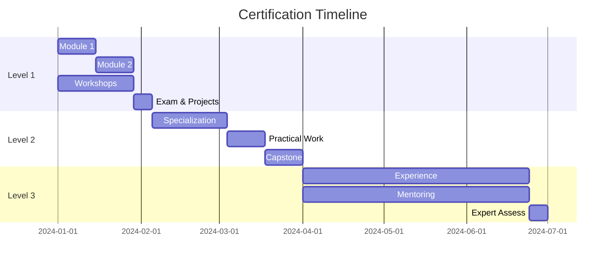

# Command Center Calendar Training Schedule & Curriculum

Comprehensive 12-week training program for Command Center Calendar knowledge management system rollout.

## 📅 12-Week Master Schedule

```
┌─────────────────────────────────────────────────────────────────────────────┐
│                      12-WEEK TRAINING MASTER SCHEDULE                         │
├─────────────────────────────────────────────────────────────────────────────┤
│                                                                               │
│  FOUNDATION PHASE (Weeks 1-4)                                                │
│  ├─ Week 1: System Orientation                                               │
│  ├─ Week 2: Basic Navigation & Tools                                         │
│  ├─ Week 3: Documentation Deep Dive                                          │
│  └─ Week 4: Foundation Assessment                                            │
│                                                                               │
│  SKILL BUILDING (Weeks 5-8)                                                  │
│  ├─ Week 5: Advanced Features                                                │
│  ├─ Week 6: Performance Optimization                                         │
│  ├─ Week 7: Security Best Practices                                          │
│  └─ Week 8: Mid-Program Assessment                                           │
│                                                                               │
│  SPECIALIZATION (Weeks 9-12)                                                 │
│  ├─ Week 9: Role-Specific Training                                           │
│  ├─ Week 10: Project-Based Learning                                          │
│  ├─ Week 11: Certification Preparation                                       │
│  └─ Week 12: Final Assessment & Graduation                                   │
│                                                                               │
└─────────────────────────────────────────────────────────────────────────────┘
```

## 🗓️ Weekly Training Calendar

### Week 1: System Orientation

```
┌─────────────────────────────────────────────────────────────────────────────┐
│                         WEEK 1: SYSTEM ORIENTATION                            │
├──────────┬──────────────────────────────────────────────────────────────────┤
│  Monday  │ 10:00-11:30  All-Hands Kickoff (Mandatory)                       │
│          │ 14:00-15:00  Self-Study: Review Documentation                    │
├──────────┼──────────────────────────────────────────────────────────────────┤
│  Tuesday │ 10:00-11:00  Workshop: Navigation Basics                         │
│          │ 14:00-15:00  Lab: Environment Setup                              │
├──────────┼──────────────────────────────────────────────────────────────────┤
│ Wednesday│ 10:00-11:00  Workshop: Using the FAQ System                      │
│          │ 14:00-15:00  Office Hours (Optional)                             │
├──────────┼──────────────────────────────────────────────────────────────────┤
│ Thursday │ 10:00-11:30  Workshop: Interactive Playground                    │
│          │ 14:00-15:00  Practice Session                                    │
├──────────┼──────────────────────────────────────────────────────────────────┤
│  Friday  │ 10:00-11:00  Week 1 Review & Q&A                                │
│          │ 14:00-15:00  Self-Assessment Quiz                                │
└──────────┴──────────────────────────────────────────────────────────────────┘
```

### Week 2: Basic Navigation & Tools

```
┌─────────────────────────────────────────────────────────────────────────────┐
│                      WEEK 2: BASIC NAVIGATION & TOOLS                         │
├──────────┬──────────────────────────────────────────────────────────────────┤
│  Monday  │ 10:00-11:30  Workshop: API Documentation Navigation              │
│          │ 14:00-15:00  Hands-on Practice                                   │
├──────────┼──────────────────────────────────────────────────────────────────┤
│  Tuesday │ 10:00-11:00  Workshop: Search Techniques                         │
│          │ 14:00-15:00  Lab: Advanced Search                                │
├──────────┼──────────────────────────────────────────────────────────────────┤
│ Wednesday│ 10:00-11:30  Workshop: Contributing to Docs                      │
│          │ 14:00-15:00  Office Hours                                        │
├──────────┼──────────────────────────────────────────────────────────────────┤
│ Thursday │ 10:00-12:00  Extended Lab: First Contribution                    │
│          │ 14:00-15:00  Peer Review Session                                 │
├──────────┼──────────────────────────────────────────────────────────────────┤
│  Friday  │ 10:00-11:00  Show & Tell: Best Discoveries                      │
│          │ 14:00-15:00  Module 1 Completion                                 │
└──────────┴──────────────────────────────────────────────────────────────────┘
```

## 📚 Training Modules & Curriculum

### Module 1: Command Center Calendar Fundamentals (Week 1-2)

```typescript
interface Module1 {
  title: "Command Center Calendar Fundamentals";
  duration: "2 weeks";
  format: "Blended (Online + Workshop)";
  
  topics: {
    week1: [
      "System overview and architecture",
      "Navigation and UI basics",
      "FAQ system mastery",
      "Interactive playground introduction"
    ];
    
    week2: [
      "API documentation deep dive",
      "Search and discovery techniques",
      "Contributing to documentation",
      "Best practices overview"
    ];
  };
  
  deliverables: [
    "Complete environment setup",
    "Navigate to 5 different doc sections",
    "Submit first FAQ entry",
    "Run 3 playground examples"
  ];
  
  assessment: {
    type: "Practical + Quiz";
    passingScore: 80;
    certification: "Command Center Calendar Basics";
  };
}
```

### Module 2: Advanced Features (Week 3-4)

```typescript
interface Module2 {
  title: "Advanced Command Center Calendar Features";
  duration: "2 weeks";
  prerequisites: ["Module 1"];
  
  topics: {
    week3: [
      "TypeDoc configuration",
      "Custom playground examples",
      "Advanced search operators",
      "Troubleshooting guide mastery"
    ];
    
    week4: [
      "CI/CD integration",
      "Automated documentation",
      "Performance monitoring",
      "Security best practices"
    ];
  };
  
  practicalExercises: [
    "Configure TypeDoc for a project",
    "Create custom playground example",
    "Resolve 3 issues using FAQ",
    "Set up CI/CD documentation pipeline"
  ];
  
  assessment: {
    project: "Document a small feature",
    presentation: "5-minute demo",
    certification: "Command Center Calendar Advanced";
  };
}
```

### Module 3: Specialization Tracks (Week 5-8)

```
┌─────────────────────────────────────────────────────────────────────────────┐
│                        SPECIALIZATION TRACK OPTIONS                           │
├─────────────────────────────────────────────────────────────────────────────┤
│                                                                               │
│  TRACK A: FRONTEND DEVELOPER PATH                                            │
│  ├─ Component documentation                                                  │
│  ├─ Interactive examples creation                                            │
│  ├─ UI/UX best practices                                                     │
│  └─ Performance optimization                                                 │
│                                                                               │
│  TRACK B: BACKEND DEVELOPER PATH                                             │
│  ├─ API documentation mastery                                                │
│  ├─ Security documentation                                                   │
│  ├─ Database schema docs                                                     │
│  └─ Integration guides                                                       │
│                                                                               │
│  TRACK C: DEVOPS PATH                                                        │
│  ├─ CI/CD documentation                                                      │
│  ├─ Deployment guides                                                        │
│  ├─ Monitoring setup                                                         │
│  └─ Infrastructure docs                                                      │
│                                                                               │
│  TRACK D: TEAM LEAD PATH                                                     │
│  ├─ Team onboarding optimization                                             │
│  ├─ Workshop facilitation                                                    │
│  ├─ Metrics and reporting                                                    │
│  └─ Change management                                                        │
│                                                                               │
└─────────────────────────────────────────────────────────────────────────────┘
```

## 🎓 Workshop Catalog

### Core Workshops (Required)

| Workshop Title | Duration | Frequency | Capacity | Prerequisites |
|---------------|----------|-----------|----------|---------------|
| System Orientation | 90 min | Weekly | 20 | None |
| Documentation Navigation | 60 min | 2x/week | 15 | Orientation |
| FAQ Mastery | 60 min | Weekly | 15 | Navigation |
| Interactive Playground | 90 min | Weekly | 12 | Navigation |
| Contributing Basics | 90 min | Weekly | 10 | Module 1 |

### Advanced Workshops (Optional)

| Workshop Title | Duration | Frequency | Capacity | Prerequisites |
|---------------|----------|-----------|----------|---------------|
| Performance Optimization | 120 min | Bi-weekly | 10 | Module 2 |
| Security Best Practices | 120 min | Bi-weekly | 10 | Module 2 |
| API Documentation Deep Dive | 90 min | Weekly | 12 | Backend Track |
| Component Documentation | 90 min | Weekly | 12 | Frontend Track |
| CI/CD Integration | 120 min | Bi-weekly | 8 | DevOps Track |

## 📝 Registration System

### Online Registration Form

```html
<!-- Registration Form Structure -->
<form id="training-registration">
  <section class="participant-info">
    <h2>Participant Information</h2>
    <input type="text" name="name" required>
    <input type="email" name="email" required>
    <select name="team" required>
      <option>Frontend Team</option>
      <option>Backend Team</option>
      <option>DevOps Team</option>
      <option>QA Team</option>
    </select>
    <select name="experience">
      <option>Junior (0-2 years)</option>
      <option>Mid-level (2-5 years)</option>
      <option>Senior (5+ years)</option>
    </select>
  </section>
  
  <section class="track-selection">
    <h2>Choose Your Track</h2>
    <input type="radio" name="track" value="frontend">
    <input type="radio" name="track" value="backend">
    <input type="radio" name="track" value="devops">
    <input type="radio" name="track" value="lead">
  </section>
  
  <section class="workshop-selection">
    <h2>Select Workshops</h2>
    <!-- Dynamic workshop list based on track -->
  </section>
  
  <section class="commitments">
    <h2>Training Commitments</h2>
    <input type="checkbox" required>
    I commit to attending all required sessions
    <input type="checkbox" required>
    I will complete homework assignments
    <input type="checkbox" required>
    I will provide feedback for improvement
  </section>
</form>
```

### Registration Tracking Spreadsheet

```
┌─────────────────────────────────────────────────────────────────────────────┐
│                        TRAINING REGISTRATION TRACKER                          │
├────────┬──────────┬────────┬────────┬───────────┬────────────┬─────────────┤
│  Name  │   Team   │ Track  │ Module │ Workshops │ Attendance │ Certified   │
├────────┼──────────┼────────┼────────┼───────────┼────────────┼─────────────┤
│ John D │ Frontend │ Front  │   2    │    8/10   │    85%     │ Level 1 ✅  │
│ Sarah M│ Backend  │ Back   │   3    │    12/12  │    100%    │ Level 2 ✅  │
│ Mike L │ DevOps   │ DevOps │   2    │    6/10   │    60%     │ In Progress │
│ Lisa K │ QA       │ Lead   │   3    │    10/10  │    100%    │ Level 2 ✅  │
│ Tom R  │ Frontend │ Front  │   1    │    4/10   │    40%     │ At Risk 🔴  │
└────────┴──────────┴────────┴────────┴───────────┴────────────┴─────────────┘
```

## 🕐 Office Hours Schedule

### Daily Office Hours

```
┌─────────────────────────────────────────────────────────────────────────────┐
│                         OFFICE HOURS SCHEDULE                                 │
├──────────┬─────────┬──────────────────┬─────────────────────────────────────┤
│   Day    │  Time   │       Host       │            Focus Area               │
├──────────┼─────────┼──────────────────┼─────────────────────────────────────┤
│  Monday  │ 4-5 PM  │ Senior Developer │ General Q&A, Troubleshooting        │
│  Tuesday │ 4-5 PM  │ Tech Lead        │ Architecture, Best Practices        │
│ Wednesday│ 12-1 PM │ DevOps Engineer  │ CI/CD, Deployment, Infrastructure  │
│ Thursday │ 4-5 PM  │ Frontend Lead    │ UI/UX, Component Documentation      │
│  Friday  │ 2-3 PM  │ Training Manager │ Progress Review, Certification      │
└──────────┴─────────┴──────────────────┴─────────────────────────────────────┘

Special Sessions:
• First Monday of month: Executive Q&A (5-6 PM)
• Last Friday of month: Retrospective & Feedback (3-5 PM)
```

## 🏆 Certification Program

### Certification Levels

```
┌─────────────────────────────────────────────────────────────────────────────┐
│                        CERTIFICATION PROGRESSION                              │
├─────────────────────────────────────────────────────────────────────────────┤
│                                                                               │
│  LEVEL 1: Command Center Calendar Certified User                                          │
│  ├─ Complete Modules 1-2                                                     │
│  ├─ Attend 5 workshops                                                       │
│  ├─ Pass written exam (80%)                                                  │
│  ├─ Submit 3 documentation contributions                                     │
│  └─ Time: 4 weeks                                                           │
│                                                                               │
│  LEVEL 2: Command Center Calendar Certified Developer                                     │
│  ├─ Complete specialization track                                            │
│  ├─ Lead 1 workshop                                                         │
│  ├─ Pass practical exam                                                      │
│  ├─ Complete capstone project                                                │
│  └─ Time: 8 weeks                                                           │
│                                                                               │
│  LEVEL 3: Command Center Calendar Certified Expert                                        │
│  ├─ 3 months experience with system                                          │
│  ├─ Mentor 2 developers                                                      │
│  ├─ Major contribution to system                                             │
│  ├─ Pass expert assessment                                                   │
│  └─ Time: 12+ weeks                                                         │
│                                                                               │
└─────────────────────────────────────────────────────────────────────────────┘
```

### Certification Timeline



## 📊 Training Metrics

### Attendance Tracking

```typescript
interface AttendanceMetrics {
  weekly: {
    target: 80;      // Percentage
    actual: 73;
    trend: 'improving';
  };
  
  byWorkshop: {
    'System Orientation': 95,
    'Documentation Navigation': 78,
    'FAQ Mastery': 82,
    'Interactive Playground': 71,
    'Contributing Basics': 65
  };
  
  byTeam: {
    'Frontend': 82,
    'Backend': 75,
    'DevOps': 68,
    'QA': 88
  };
}
```

### Progress Tracking Dashboard

```
┌─────────────────────────────────────────────────────────────────────────────┐
│                      TRAINING PROGRESS DASHBOARD                              │
├─────────────────────────────────────────────────────────────────────────────┤
│                                                                               │
│  MODULE COMPLETION                                                           │
│  Module 1: ████████████████████░░ 85% (34/40 participants)                  │
│  Module 2: ████████████░░░░░░░░░░ 60% (24/40 participants)                  │
│  Module 3: ██████░░░░░░░░░░░░░░░░ 30% (12/40 participants)                  │
│                                                                               │
│  CERTIFICATION STATUS                                                        │
│  Level 1: ████████████░░░░░░░░░░ 15 certified                               │
│  Level 2: ████░░░░░░░░░░░░░░░░░░ 5 certified                                │
│  Level 3: ░░░░░░░░░░░░░░░░░░░░░░ 0 certified                                │
│                                                                               │
│  WORKSHOP ATTENDANCE (This Week)                                             │
│  Monday:   ████████████████░░░░░░ 16/20                                     │
│  Tuesday:  ██████████████░░░░░░░░ 14/20                                     │
│  Wednesday:████████████░░░░░░░░░░ 12/20                                     │
│  Thursday: ██████████████████░░░░ 18/20                                     │
│  Friday:   ████████████░░░░░░░░░░ 12/20                                     │
│                                                                               │
└─────────────────────────────────────────────────────────────────────────────┘
```

## 🎯 Success Indicators

### Training Program KPIs

| KPI | Target | Current | Status |
|-----|--------|---------|--------|
| Workshop Attendance | 80% | 73% | ⚠️ |
| Module Completion | 90% | 85% | ⚠️ |
| Certification Rate | 70% | 62% | 🔴 |
| Satisfaction Score | 4.5/5 | 4.3/5 | ⚠️ |
| Knowledge Retention | 80% | 77% | ⚠️ |
| Time to Productivity | 5 days | 6 days | ⚠️ |

## 📋 Training Resources

### Required Materials

```
┌─────────────────────────────────────────────────────────────────────────────┐
│                         TRAINING RESOURCE LIBRARY                             │
├─────────────────────────────────────────────────────────────────────────────┤
│                                                                               │
│  DOCUMENTATION                                                               │
│  ├─ Developer Onboarding Guide (PDF)                                         │
│  ├─ API Reference Manual (Online)                                            │
│  ├─ FAQ System Guide (Online)                                                │
│  └─ Best Practices Handbook (PDF)                                            │
│                                                                               │
│  VIDEOS                                                                       │
│  ├─ System Overview (15 min)                                                 │
│  ├─ Setup Tutorial (10 min)                                                  │
│  ├─ First Feature Walkthrough (20 min)                                       │
│  └─ Workshop Recordings (Archive)                                            │
│                                                                               │
│  EXERCISES                                                                    │
│  ├─ Module 1 Exercises (GitHub)                                              │
│  ├─ Module 2 Exercises (GitHub)                                              │
│  ├─ Specialization Projects (GitHub)                                         │
│  └─ Certification Practice (Online)                                          │
│                                                                               │
│  TOOLS                                                                        │
│  ├─ Interactive Playground                                                   │
│  ├─ VS Code Extension Pack                                                   │
│  ├─ Chrome DevTools Config                                                   │
│  └─ Testing Environment Access                                               │
│                                                                               │
└─────────────────────────────────────────────────────────────────────────────┘
```

## 🔄 Continuous Improvement

### Feedback Collection Points

1. **Post-Workshop Surveys** (Immediate)
2. **Module Completion Reviews** (Weekly)
3. **Certification Feedback** (Monthly)
4. **Retrospectives** (Monthly)
5. **Exit Interviews** (As needed)

### Iteration Cycle

```
Week 1-2: Collect feedback
Week 3: Analyze and prioritize
Week 4: Implement improvements
Week 5: Validate changes
Week 6: Roll out updates
```

---

*This training schedule provides a comprehensive 12-week program for successful Command Center Calendar adoption. Adjust timing and content based on team needs and feedback.*