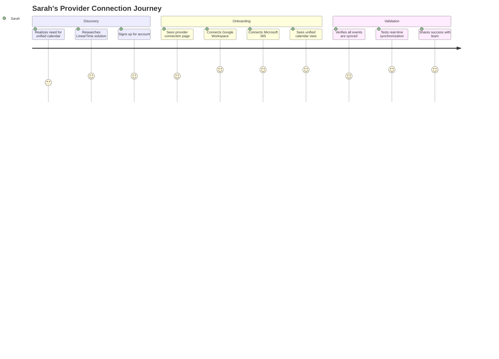
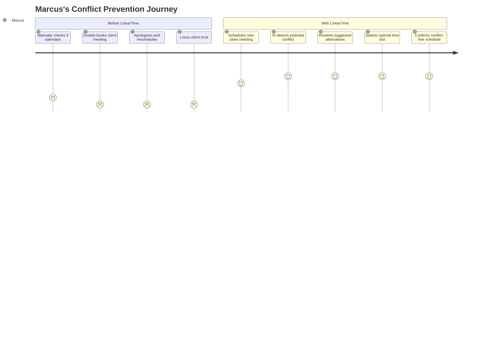
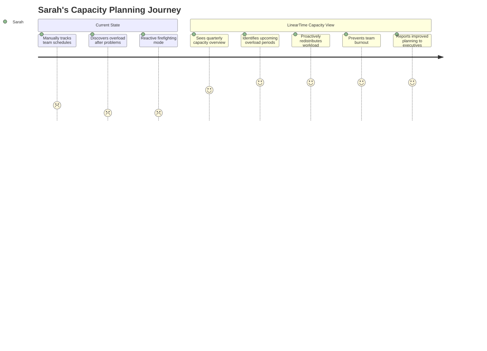
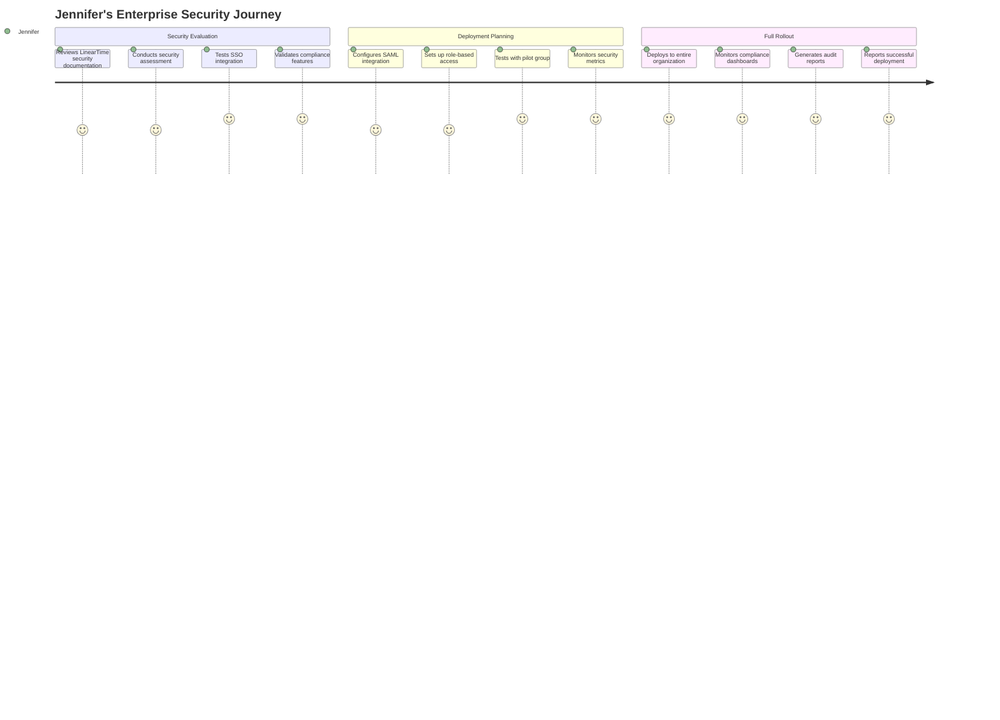
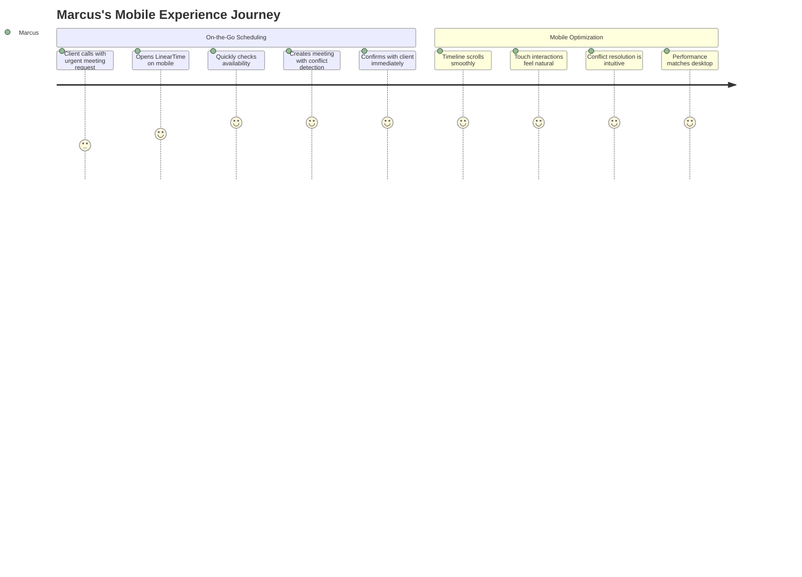
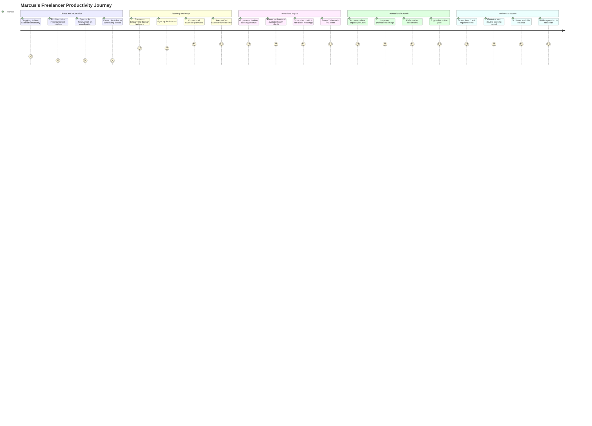
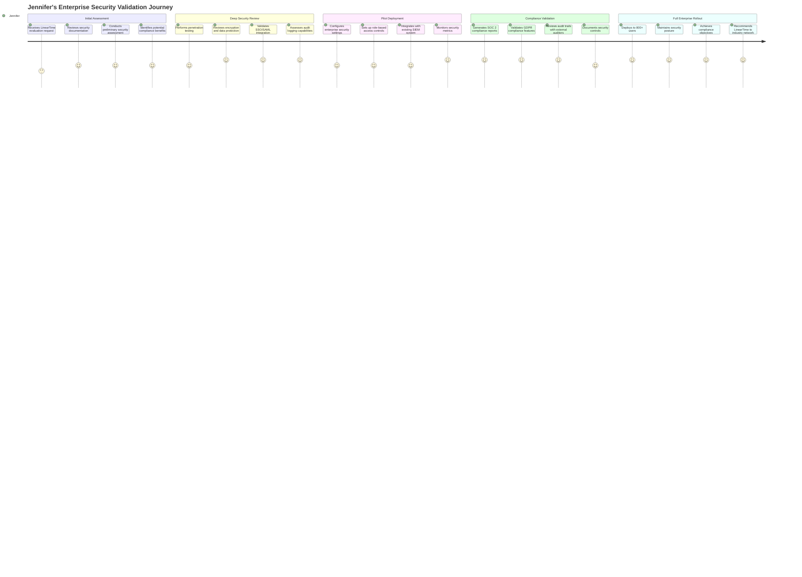

# User Stories and Journey Maps
## LinearTime AI-Powered Scheduling Efficiency Platform

---

**Document Version**: 1.0  
**Date**: January 2025  
**Status**: Implementation Ready  
**Alignment**: Ultimate PRD v3.0 & Technical Architecture v1.0  

---

## 👥 Primary User Personas

### Persona 1: Sarah - B2B Operations Manager
**Demographics**: 32, Operations Manager at 150-person SaaS company  
**Tech Stack**: Mixed Google Workspace + Microsoft 365, Zoom, Slack  
**Goals**: Reduce coordination overhead, improve team efficiency, satisfy security requirements  
**Frustrations**: Manual conflict resolution, no quarterly visibility, security tool restrictions  

### Persona 2: Marcus - Freelance Consultant  
**Demographics**: 28, Independent consultant serving 5 clients  
**Tech Stack**: Personal Google, Client Microsoft, Apple Calendar  
**Goals**: Prevent double-booking, professional availability sharing, workload planning  
**Frustrations**: Multiple calendar checking, client coordination, time zone confusion  

### Persona 3: Jennifer - Enterprise IT Director
**Demographics**: 45, IT Director at 800-person financial services firm  
**Tech Stack**: Microsoft 365, Salesforce, enterprise security tools  
**Goals**: Secure deployment, compliance validation, user adoption  
**Frustrations**: Security reviews, compliance reporting, integration complexity  

---

## 📖 Epic User Stories

## Epic 1: Multi-Provider Calendar Unification

### Story 1.1: Initial Provider Connection
```gherkin
Feature: Connect Multiple Calendar Providers
  As a user with calendars across multiple providers
  I want to securely connect all my calendar accounts
  So that I have one unified view of my schedule

Background:
  Given I am a new LinearTime user
  And I have calendars in Google, Microsoft, and Apple
  
Scenario: Connect Google Calendar
  Given I am on the provider connection page
  When I click "Connect Google Calendar"
  And I complete OAuth authentication successfully
  Then I should see my Google events in the unified timeline
  And real-time sync should be established
  And I should receive a confirmation notification
  
  Examples:
    | Provider | Auth Method | Expected Sync Time |
    | Google   | OAuth 2.0   | < 30 seconds       |
    | Microsoft| OAuth 2.0   | < 30 seconds       |
    | Apple    | CalDAV      | < 60 seconds       |

Scenario: Handle Authentication Failure
  Given I am connecting a Google Calendar
  When OAuth authentication fails
  Then I should see a clear error message
  And I should be offered troubleshooting steps
  And I should be able to retry the connection
  
Scenario: Multiple Provider Connection
  Given I have successfully connected Google Calendar
  When I connect Microsoft Calendar
  Then both calendars should appear in unified view
  And events from both providers should be synchronized
  And no duplicate events should be created
```

**Acceptance Criteria:**
- ✅ OAuth 2.0 authentication for Google and Microsoft
- ✅ CalDAV authentication for Apple and generic providers  
- ✅ Connection status indicators and error handling
- ✅ Automatic token refresh and re-authentication
- ✅ Provider connection testing and validation

**Journey Map:**


### Story 1.2: Cross-Provider Event Management
```gherkin
Feature: Unified Event Management
  As a user with multiple calendar providers
  I want to create and manage events across all providers
  So that I can work seamlessly regardless of provider

Scenario: Create Event in Any Provider
  Given I have connected Google and Microsoft calendars
  When I create a new event in the unified timeline
  And I select "Microsoft Calendar" as the provider
  Then the event should be created in Microsoft Calendar
  And it should appear in the unified view immediately
  And it should sync to Microsoft within 5 seconds
  
Scenario: Edit Cross-Provider Event
  Given I have an event from Google Calendar
  When I edit the event in LinearTime
  Then the changes should sync back to Google Calendar
  And I should see real-time update confirmation
  And the event should maintain its provider association

Scenario: Delete Event with Confirmation
  Given I have an event from Microsoft Calendar
  When I delete the event in LinearTime
  Then I should see a confirmation dialog
  When I confirm the deletion
  Then the event should be deleted from Microsoft Calendar
  And removed from the unified view
  And I should receive deletion confirmation
```

**Acceptance Criteria:**
- ✅ Create events in any connected provider
- ✅ Edit events with real-time synchronization
- ✅ Delete events with confirmation and provider sync
- ✅ Maintain provider association and metadata
- ✅ Handle sync conflicts and resolution

## Epic 2: AI Conflict Prevention

### Story 2.1: Real-Time Conflict Detection
```gherkin
Feature: Intelligent Conflict Detection
  As a busy professional
  I want AI to detect scheduling conflicts automatically
  So that I never have overlapping meetings

Scenario: Detect Time Overlap Conflict
  Given I have a meeting from 2:00 PM - 3:00 PM on Monday
  When I try to schedule another meeting from 2:30 PM - 3:30 PM on Monday
  Then the system should detect a time overlap conflict
  And highlight the conflicting events in red
  And show conflict details in a sidebar
  And the conflict detection should complete in < 200ms

Scenario: Detect Travel Time Conflict
  Given I have a meeting at "Office Building A" from 2:00 PM - 3:00 PM
  When I try to schedule a meeting at "Office Building B" from 3:00 PM - 4:00 PM
  And the travel time between locations is 20 minutes
  Then the system should detect a travel time conflict
  And suggest alternative times with adequate travel buffer
  And show travel time calculation details

Scenario: Detect Capacity Overload
  Given I already have 7 hours of meetings scheduled for Monday
  And my working day is 8 hours
  When I try to schedule a 2-hour meeting on Monday
  Then the system should detect a capacity overload
  And warn about exceeding daily capacity limits
  And suggest alternative days with available capacity
```

**Acceptance Criteria:**
- ✅ Time overlap detection with <200ms response time
- ✅ Travel time conflict analysis with location data
- ✅ Capacity overload warnings with workload calculation
- ✅ Visual conflict indicators in timeline
- ✅ Detailed conflict information and explanations

**Journey Map:**


### Story 2.2: AI-Powered Repair Suggestions
```gherkin
Feature: Intelligent Conflict Resolution
  As a user facing scheduling conflicts
  I want AI to suggest optimal repair options
  So that I can resolve conflicts quickly and efficiently

Scenario: Generate Multiple Repair Options
  Given I have a scheduling conflict between Meeting A and Meeting B
  When the AI conflict system analyzes the conflict
  Then it should generate 3-5 repair suggestions
  And each suggestion should have a confidence score
  And suggestions should be ranked by feasibility
  And each suggestion should include implementation steps

Scenario: Accept AI Repair Suggestion
  Given I have conflict repair suggestions available
  When I select the highest-ranked suggestion
  And click "Apply Repair"
  Then the system should implement the suggested changes
  And update all affected events automatically
  And send notifications to relevant attendees
  And confirm successful conflict resolution

Scenario: Customize Repair Preferences
  Given I am reviewing repair suggestions
  When I set preferences for "prefer morning meetings"
  And regenerate suggestions
  Then the AI should prioritize morning time slots
  And adjust suggestion rankings accordingly
  And explain how preferences influenced suggestions
```

**Acceptance Criteria:**
- ✅ Generate 3-5 repair options per conflict
- ✅ Confidence scores and feasibility ranking
- ✅ One-click repair implementation
- ✅ Automatic attendee notifications
- ✅ User preference learning and adaptation

### Story 2.3: Predictive Conflict Prevention
```gherkin
Feature: Predictive Scheduling Intelligence
  As a proactive scheduler
  I want AI to predict and prevent conflicts before they occur
  So that I can maintain an optimal schedule

Scenario: Predict Future Conflicts
  Given I have recurring meetings and patterns
  When I schedule a new recurring meeting
  Then the AI should analyze 2-4 weeks ahead
  And predict potential future conflicts
  And warn about recurring conflict patterns
  And suggest optimal recurring time slots

Scenario: Learn User Patterns
  Given I consistently reschedule Friday afternoon meetings
  When I try to schedule a new Friday afternoon meeting
  Then the AI should suggest alternative times
  And explain the pattern-based recommendation
  And offer to update my scheduling preferences

Scenario: Organizational Rule Compliance
  Given my organization has "no meetings before 9 AM" policy
  When I try to schedule an 8:30 AM meeting
  Then the system should prevent the scheduling
  And explain the policy violation
  And suggest compliant alternative times
```

**Acceptance Criteria:**
- ✅ 2-4 week conflict prediction with 85-90% accuracy
- ✅ User pattern recognition and learning
- ✅ Organizational policy enforcement
- ✅ Pattern-based scheduling recommendations
- ✅ Continuous learning from user behavior

## Epic 3: Capacity Forecasting & Planning

### Story 3.1: Workload Density Visualization
```gherkin
Feature: Visual Capacity Management
  As a team leader planning workload
  I want to see capacity density across time periods
  So that I can optimize resource allocation

Scenario: View Monthly Capacity Ribbons
  Given I am viewing the 12-month horizontal timeline
  When capacity forecasting is enabled
  Then I should see capacity ribbons for each month
  And ribbons should use color coding (green/yellow/red)
  And ribbon height should indicate workload density
  And hover should show detailed capacity metrics

Scenario: Identify Overload Periods
  Given I have capacity visualization enabled
  When any month shows >80% capacity utilization
  Then that month should be highlighted in yellow
  When any month shows >95% capacity utilization
  Then that month should be highlighted in red
  And I should see overload warnings and recommendations

Scenario: Compare Team Capacity
  Given I am a team manager with team view access
  When I view team capacity dashboard
  Then I should see individual and aggregated capacity
  And identify team members approaching overload
  And see capacity distribution recommendations
```

**Acceptance Criteria:**
- ✅ Visual capacity ribbons integrated with 12-month timeline
- ✅ Color-coded capacity indicators (green/yellow/red)
- ✅ Workload density calculation (0-1 scale)
- ✅ Team aggregation and comparison views
- ✅ Overload alerts at 80% and 95% thresholds

**Journey Map:**


### Story 3.2: Capacity Forecasting
```gherkin
Feature: Predictive Capacity Management
  As a strategic planner
  I want AI to forecast future capacity needs
  So that I can plan resource allocation proactively

Scenario: Generate 2-Week Capacity Forecast
  Given I have 3+ months of historical calendar data
  When I request a 2-week capacity forecast
  Then the AI should predict daily capacity utilization
  And provide 85-90% accuracy confidence intervals
  And highlight predicted overload periods
  And suggest proactive scheduling adjustments

Scenario: Seasonal Pattern Recognition
  Given I have 12+ months of historical data
  When the AI analyzes seasonal patterns
  Then it should identify recurring busy/slow periods
  And predict similar patterns for the next year
  And recommend capacity planning strategies
  And adjust forecasts based on seasonal trends

Scenario: External Factor Integration
  Given I have company events and holidays configured
  When generating capacity forecasts
  Then the AI should account for external factors
  And adjust predictions for holiday periods
  And consider company-wide events and meetings
  And provide context for forecast adjustments
```

**Acceptance Criteria:**
- ✅ 2-week forecasts with 85-90% accuracy
- ✅ Seasonal pattern recognition and prediction
- ✅ External factor integration (holidays, events)
- ✅ Confidence intervals and uncertainty quantification
- ✅ Proactive scheduling recommendations

### Story 3.3: Team Capacity Collaboration
```gherkin
Feature: Collaborative Capacity Planning
  As a team manager
  I want to share capacity insights with my team
  So that we can collaboratively optimize our schedules

Scenario: Share Team Capacity Dashboard
  Given I am a team manager
  When I enable team capacity sharing
  Then team members should see shared capacity view
  And identify optimal times for team meetings
  And understand individual contribution to team load
  And receive capacity-based scheduling suggestions

Scenario: Collaborative Meeting Scheduling
  Given I need to schedule a team meeting
  When I use AI-powered team scheduling
  Then the system should find optimal times for all attendees
  And minimize impact on individual capacity
  And suggest meeting duration based on capacity
  And provide alternative options if conflicts exist

Scenario: Capacity-Based Project Planning
  Given I am planning a project with multiple team members
  When I input project requirements and timeline
  Then the system should analyze team capacity availability
  And suggest realistic project timelines
  And identify potential resource constraints
  And recommend capacity optimization strategies
```

**Acceptance Criteria:**
- ✅ Team capacity sharing and collaboration features
- ✅ AI-powered team meeting optimization
- ✅ Project timeline feasibility analysis
- ✅ Resource constraint identification
- ✅ Collaborative capacity planning tools

## Epic 4: Enterprise Security & Compliance

### Story 4.1: Enterprise Authentication
```gherkin
Feature: Enterprise SSO Integration
  As an IT administrator
  I want to integrate LinearTime with our SSO system
  So that users can access securely without additional passwords

Scenario: Configure SAML SSO
  Given I am an IT administrator
  When I configure SAML SSO integration
  And provide our identity provider metadata
  Then LinearTime should integrate with our SSO system
  And users should be able to login with corporate credentials
  And user provisioning should be automated
  And access should be centrally managed

Scenario: Enforce Multi-Factor Authentication
  Given SSO is configured with MFA requirements
  When users attempt to access LinearTime
  Then they should be required to complete MFA
  And MFA should be handled by our identity provider
  And failed MFA attempts should be logged and reported
  And security policies should be enforced consistently

Scenario: Role-Based Access Control
  Given I need to manage user permissions
  When I configure role-based access control
  Then I should be able to define custom roles
  And assign different permissions to each role
  And control access to features and data
  And audit role assignments and changes
```

**Acceptance Criteria:**
- ✅ SAML 2.0 SSO integration
- ✅ Multi-factor authentication support
- ✅ Role-based access control (RBAC)
- ✅ Automated user provisioning
- ✅ Centralized access management

**Journey Map:**


### Story 4.2: Audit Logging & Compliance
```gherkin
Feature: Comprehensive Audit Logging
  As a compliance officer
  I want detailed audit logs of all system activities
  So that I can demonstrate compliance and investigate incidents

Scenario: Generate Audit Trail
  Given users are actively using LinearTime
  When any security-relevant action occurs
  Then it should be logged with complete details
  And logs should include user, action, timestamp, and context
  And logs should be stored in tamper-proof format
  And logs should be available for compliance reporting

Scenario: Export Compliance Reports
  Given I need to generate a SOC 2 compliance report
  When I request a compliance report for a specific period
  Then the system should generate a comprehensive report
  And include all relevant audit events
  And provide evidence for compliance controls
  And format the report for auditor review

Scenario: Real-Time Security Monitoring
  Given security monitoring is enabled
  When suspicious activities are detected
  Then alerts should be generated immediately
  And security team should be notified
  And automated response actions should be triggered
  And incidents should be logged for investigation
```

**Acceptance Criteria:**
- ✅ Comprehensive audit logging for all activities
- ✅ Tamper-proof log storage with integrity verification
- ✅ Automated compliance report generation
- ✅ Real-time security monitoring and alerting
- ✅ Integration with SIEM systems

### Story 4.3: Data Privacy & Protection
```gherkin
Feature: Enterprise Data Protection
  As a data protection officer
  I want robust data privacy controls
  So that we comply with GDPR, CCPA, and other regulations

Scenario: Data Encryption at Rest
  Given calendar data is stored in the system
  When data is written to storage
  Then it should be encrypted with AES-256-GCM
  And encryption keys should be properly managed
  And key rotation should occur automatically
  And decryption should require proper authentication

Scenario: Data Subject Rights
  Given a user requests data deletion (right to be forgotten)
  When I process the deletion request
  Then all user data should be permanently deleted
  And deletion should be verified and documented
  And the user should receive confirmation
  And audit logs should record the deletion

Scenario: Cross-Border Data Transfer
  Given we have users in different countries
  When data needs to be transferred internationally
  Then transfers should comply with data residency requirements
  And appropriate safeguards should be in place
  And data processing agreements should be enforced
  And users should be informed of data locations
```

**Acceptance Criteria:**
- ✅ AES-256-GCM encryption for data at rest
- ✅ Data subject rights implementation (GDPR)
- ✅ Cross-border data transfer compliance
- ✅ Data retention and deletion policies
- ✅ Privacy impact assessments

## Epic 5: Mobile & Cross-Platform Experience

### Story 5.1: Mobile-Responsive Timeline
```gherkin
Feature: Mobile Calendar Experience
  As a mobile user
  I want full calendar functionality on my phone
  So that I can manage my schedule while on the go

Scenario: Mobile Timeline Navigation
  Given I am using LinearTime on my mobile device
  When I view the 12-month horizontal timeline
  Then it should be optimized for touch interaction
  And I should be able to scroll horizontally smoothly
  And pinch-to-zoom should work for detailed views
  And touch targets should be appropriately sized (44px minimum)

Scenario: Mobile Event Creation
  Given I am on mobile and need to create an event
  When I tap on a time slot in the timeline
  Then a mobile-optimized event creation form should appear
  And I should be able to input all event details easily
  And the form should adapt to mobile keyboard
  And creation should work with conflict detection

Scenario: Mobile Conflict Resolution
  Given I have a scheduling conflict on mobile
  When I tap on the conflict indicator
  Then I should see mobile-friendly conflict details
  And repair suggestions should be easy to review
  And I should be able to apply repairs with simple taps
  And confirmation should be clear and immediate
```

**Acceptance Criteria:**
- ✅ Touch-optimized horizontal timeline interface
- ✅ Mobile-responsive event creation and editing
- ✅ Gesture support (pinch, pan, tap, swipe)
- ✅ Minimum 44px touch targets
- ✅ Mobile-optimized conflict resolution

**Journey Map:**


### Story 5.2: Offline Capability
```gherkin
Feature: Offline Calendar Access
  As a frequent traveler
  I want to access my calendar when offline
  So that I can stay productive without internet connection

Scenario: Offline Calendar Viewing
  Given I have used LinearTime recently while online
  When I lose internet connection
  Then I should still be able to view my recent calendar data
  And see events for the next 30 days
  And view capacity information
  And access conflict information from last sync

Scenario: Offline Event Creation
  Given I am offline and need to create an event
  When I create a new event in offline mode
  Then the event should be saved locally
  And marked as "pending sync"
  And basic conflict detection should work with local data
  And the event should sync when connection is restored

Scenario: Conflict Resolution During Sync
  Given I created events while offline
  When internet connection is restored
  Then the system should sync offline changes
  And detect any conflicts with server data
  And present resolution options if conflicts exist
  And ensure data consistency after sync
```

**Acceptance Criteria:**
- ✅ 30-day offline calendar data caching
- ✅ Offline event creation and editing
- ✅ Local conflict detection capabilities
- ✅ Automatic sync when connection restored
- ✅ Conflict resolution for offline changes

## Epic 6: Advanced Integration & Automation

### Story 6.1: Smart Meeting Insights
```gherkin
Feature: Meeting Analytics and Insights
  As a productivity-focused professional
  I want insights about my meeting patterns
  So that I can optimize my schedule and work habits

Scenario: Meeting Pattern Analysis
  Given I have 3+ months of calendar history
  When I view meeting insights dashboard
  Then I should see patterns in my meeting behavior
  And identify my most and least productive meeting times
  And see meeting frequency trends over time
  And receive recommendations for schedule optimization

Scenario: Meeting Efficiency Metrics
  Given I have meetings with different durations and attendee counts
  When I analyze meeting efficiency
  Then I should see average meeting length by type
  And identify meetings that frequently run over time
  And see attendee engagement patterns
  And receive suggestions for meeting optimization

Scenario: Focus Time Analysis
  Given I want to maximize deep work time
  When I analyze my focus time availability
  Then I should see blocks of uninterrupted time
  And identify optimal times for focused work
  And receive recommendations for protecting focus time
  And see trends in focus time availability
```

**Acceptance Criteria:**
- ✅ Meeting pattern recognition and analysis
- ✅ Efficiency metrics and trends visualization
- ✅ Focus time identification and protection
- ✅ Personalized optimization recommendations
- ✅ Historical trend analysis and insights

### Story 6.2: Integration Ecosystem
```gherkin
Feature: Third-Party Tool Integration
  As a user of multiple productivity tools
  I want LinearTime to integrate with my existing workflow
  So that I can maintain productivity without switching contexts

Scenario: Slack Integration
  Given I use Slack for team communication
  When I connect LinearTime to Slack
  Then I should receive meeting reminders in Slack
  And be able to create events from Slack messages
  And share availability status in Slack
  And get conflict alerts in relevant channels

Scenario: Project Management Integration
  Given I use Asana for project management
  When I connect LinearTime to Asana
  Then project deadlines should appear in my calendar
  And I should be able to schedule project work time
  And see project-related meetings in context
  And track time allocation across projects

Scenario: Video Conferencing Integration
  Given I use Zoom for video meetings
  When I create a meeting in LinearTime
  Then Zoom meeting links should be automatically generated
  And meeting details should be synced to Zoom
  And I should receive unified meeting notifications
  And attendance should be tracked across platforms
```

**Acceptance Criteria:**
- ✅ Slack integration for notifications and commands
- ✅ Project management tool synchronization
- ✅ Video conferencing platform integration
- ✅ Unified notification and reminder system
- ✅ Cross-platform attendance tracking

---

## 🎯 Success Metrics for User Stories

### Onboarding & Adoption Metrics
```typescript
interface OnboardingMetrics {
  timeToFirstValue: {
    target: "<15 minutes";
    measurement: "Time from signup to first provider connection";
    currentBaseline: "Unknown - new feature";
  };
  
  setupCompletionRate: {
    target: "≥85%";
    measurement: "Users completing full onboarding flow";
    currentBaseline: "Unknown - new feature";
  };
  
  featureDiscovery: {
    target: "≥70% discover AI conflict prevention within first week";
    measurement: "Users who use AI features in first 7 days";
    currentBaseline: "Unknown - new feature";
  };
}
```

### User Engagement Metrics
```typescript
interface EngagementMetrics {
  dailyActiveUsers: {
    target: "≥40% of registered users";
    measurement: "Daily active / Total registered";
    industryBenchmark: "30-35% for productivity tools";
  };
  
  conflictPreventionUsage: {
    target: "≥60% of users use AI conflict prevention weekly";
    measurement: "Users triggering conflict detection / Total active users";
    currentBaseline: "Unknown - new feature";
  };
  
  capacityViewUsage: {
    target: "≥50% of users view capacity forecasting monthly";
    measurement: "Users accessing capacity views / Total active users";
    currentBaseline: "Unknown - new feature";
  };
}
```

### Efficiency & Productivity Metrics
```typescript
interface ProductivityMetrics {
  timeSaved: {
    target: "≥2.4 hours/week per user";
    measurement: "Self-reported time savings surveys + usage analytics";
    currentBaseline: "Unknown - establish through pilot program";
  };
  
  conflictReduction: {
    target: "≥80% reduction in scheduling conflicts";
    measurement: "Conflicts before vs after implementation";
    currentBaseline: "Unknown - measure during pilot";
  };
  
  schedulingEfficiency: {
    target: "≥50% reduction in scheduling coordination time";
    measurement: "Time spent on scheduling tasks";
    currentBaseline: "2.4 hours/week industry average";
  };
}
```

### Satisfaction & Retention Metrics
```typescript
interface SatisfactionMetrics {
  netPromoterScore: {
    target: "≥50";
    measurement: "NPS survey responses";
    industryBenchmark: "30-40 for productivity tools";
  };
  
  userRetention: {
    target: "≥60% 7-day retention, ≥40% 30-day retention";
    measurement: "Users active on day 7/30 / Day 1 signups";
    industryBenchmark: "40-50% 7-day, 25-35% 30-day";
  };
  
  featureSatisfaction: {
    target: "≥4.0/5.0 rating for core features";
    measurement: "Feature satisfaction surveys";
    currentBaseline: "Unknown - establish baseline";
  };
}
```

---

## 🗺️ Implementation Journey Maps

### Journey Map 1: Sarah's Enterprise Adoption Journey


### Journey Map 2: Marcus's Freelancer Success Journey



### Journey Map 3: Jennifer's IT Security Journey



---

## 🎯 Conclusion

These comprehensive user stories and journey maps provide the detailed blueprint for implementing LinearTime's AI-powered scheduling efficiency platform. Each story includes:

- **Detailed scenarios** with acceptance criteria
- **Performance requirements** aligned with technical architecture
- **Success metrics** for measuring implementation success
- **Journey maps** showing complete user experiences

**Key Implementation Priorities:**

1. **Epic 1 & 2** - Core multi-provider integration and AI conflict prevention
2. **Epic 3** - Capacity forecasting and quarterly planning
3. **Epic 4** - Enterprise security and compliance features
4. **Epic 5** - Mobile optimization and cross-platform experience
5. **Epic 6** - Advanced integrations and automation

These stories directly support the Ultimate PRD objectives and provide clear guidance for development teams, ensuring that every feature delivers measurable user value while maintaining the technical excellence that sets LinearTime apart from competitors.

**Ready for implementation with clear success criteria and user-centric design principles.**
